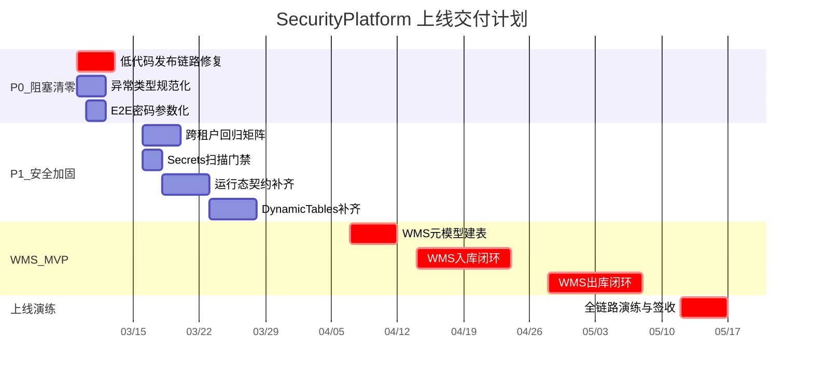

# SecurityPlatform 上线交付全量实施计划

## 报告勘误（代码验证结论）

深度审查报告中部分结论与仓库实际代码存在偏差，需先纠正：


| 报告结论                                | 实际状态                                                                    | 证据                                                                                                                  |
| ----------------------------------- | ----------------------------------------------------------------------- | ------------------------------------------------------------------------------------------------------------------- |
| `docker-compose.yml` 缺失导致 Deploy 阻塞 | **已解决** - 文件存在且配置完整（backend/frontend/nginx 三服务）                         | [docker-compose.yml](docker-compose.yml)                                                                            |
| SQLite 备份采用简单文件拷贝                   | **已解决** - 已使用 SQLite Online Backup API (`BackupDatabase()`) + SHA256 校验 | [DatabaseBackupHostedService.cs](src/backend/Atlas.Infrastructure/Services/DatabaseBackupHostedService.cs) L158-167 |
| Gate-R2 取证材料泄露 token/口令             | **部分准确** - 无 Gate-R2 证据文件，仅 Gate-R1 且不含 token；但 e2e 硬编码开发密码             | `docs/evidence/gate-r1-20260308/`                                                                                   |
| 分页参数风格不一致                           | **已解决** - contracts.md 已统一规则：`PageIndex/PageSize` 为标准，向下兼容 camelCase    | [contracts.md](docs/contracts.md) L235-237                                                                          |
| DoD 验收清单未完成                         | **已完成** - 6 个维度全部勾选                                                     | [platform-dod-acceptance.md](docs/platform-dod-acceptance.md)                                                       |


**结论：报告标记的 3 个 P0 中，仅"低代码发布链路"是真正的阻塞项。**

---

## 第一阶段：P0 阻塞清零（3/9 - 3/14）

### 1.1 修复低代码应用发布链路断裂

**问题根因**：`LowCodeAppCommandService.CreateAsync` 创建 `LowCodeApp` 时不会自动创建 `AppManifest`，但 `LowCodePageCommandService.PublishAsync` 在 L124-128 强依赖 `AppManifest` 存在：

```124:128:src/backend/Atlas.Infrastructure/Services/LowCode/LowCodePageCommandService.cs
        var manifest = await _db.Queryable<AppManifest>()
            .FirstAsync(
                x => x.TenantIdValue == tenantId.Value && x.AppKey == app.AppKey,
                cancellationToken)
            ?? throw new InvalidOperationException($"应用清单 AppKey={app.AppKey} 不存在");
```

**修复方案**：在 `LowCodeAppCommandService.CreateAsync` 中同步创建对应的 `AppManifest`，确保"创建应用 -> 创建页面 -> 发布页面 -> 运行态访问"链路畅通。

**改动文件**：

- [LowCodeAppCommandService.cs](src/backend/Atlas.Infrastructure/Services/LowCode/LowCodeAppCommandService.cs) - CreateAsync 中追加 AppManifest 创建
- 对应的集成测试 / `.http` 文件验证

**验收标准**：

- `POST /api/v1/lowcode-apps` 创建应用后，`AppManifest` 同步存在
- `POST /api/v1/lowcode-apps/pages/{pageId}/publish` 不再 500
- e2e 可完成"创建应用 -> 创建页面 -> 发布页面 -> 运行态访问 schema"全链路

### 1.2 异常类型规范化（InvalidOperationException -> BusinessException）

**问题**：低代码域大量使用 `InvalidOperationException` 抛出业务错误，被 `ExceptionHandlingMiddleware` 统一捕获后返回 500，实际应为 400/404/409 等。

**改动范围**：

- [LowCodeAppCommandService.cs](src/backend/Atlas.Infrastructure/Services/LowCode/LowCodeAppCommandService.cs) - 约 10 处
- [LowCodePageCommandService.cs](src/backend/Atlas.Infrastructure/Services/LowCode/LowCodePageCommandService.cs) - 约 8 处
- 将 `throw new InvalidOperationException(...)` 替换为 `throw new BusinessException(ErrorCodes.XXX, ...)`

**验收标准**：业务校验失败返回 4xx 而非 500

### 1.3 E2E 测试密码参数化

**问题**：

- `e2e/fixtures/auth.fixture.ts` L12-13 硬编码 `admin` / `P@ssw0rd!`
- `e2e/specs/gate-r1-productization.spec.ts` L23-24 同样硬编码

**修复**：改为读取环境变量 `E2E_TEST_USERNAME` / `E2E_TEST_PASSWORD`，CI 通过 secrets 注入。

---

## 第二阶段：P1 安全加固与规范统一（3/16 - 3/28）

### 2.1 跨租户一致性校验专项回归

**现状**：`TenantContextMiddleware` 已实现 header/claim 一致性校验，但 Gate 取证曾出现偏差线索，需补充自动化回归矩阵。

**改动**：

- 新增集成测试用例：伪造 `X-Tenant-Id` 与 token claim 不一致 -> 必须 403
- 覆盖 AllowAnonymous 端点、skip 路径等边界场景
- 更新 `.http` 测试文件

### 2.2 Secrets 扫描门禁

**改动**：在 `.github/workflows/ci.yml` 中新增 secrets scanning step（如 `trufflesecurity/trufflehog` 或 `gitleaks`），阻断含密钥的提交。

### 2.3 运行态契约补齐

**现状**（来自探索结果）：

- `GET /api/v1/runtime/tasks/done`（已办）未实现
- 运行态 action 接口路径与 contracts.md 有偏差

**改动**：

- `RuntimeTasksController` 补齐已办查询端点
- 对齐 contracts.md 中的运行态路由定义

### 2.4 DynamicTables 能力补齐

- `removeFields` Alter 操作需完善（当前返回 VALIDATION_ERROR）
- 字段级 `validation`（regex/minLength/maxLength）实现与契约对齐

---

## 第三阶段：WMS MVP 元模型与建表（4/7 - 4/11）

### 3.1 WMS 数据字典设计

基于平台 `DynamicTables` 能力建模，MVP 需要以下核心表：

- **warehouse**：仓库主数据（code, name, address, type, status）
- **location**：库区/库位（warehouseCode, zoneCode, locationCode, type, capacity, status）
- **sku**：SKU 主数据（skuCode, name, unit, barcode, category, weight, volume）
- **inventory**：库存现量（locationCode, skuCode, batchNo, quantity, lockedQuantity, availableQuantity）
- **inventory_transaction**：库存流水（transactionType, skuCode, locationCode, quantity, beforeQty, afterQty, referenceNo, operator, timestamp）
- **inbound_order**：入库单（orderNo, type, supplierName, status, expectedDate, completedDate）
- **inbound_order_line**：入库单行（orderId, skuCode, expectedQty, receivedQty, status）
- **outbound_order**：出库单（orderNo, type, customerName, status, requiredDate, completedDate）
- **outbound_order_line**：出库单行（orderId, skuCode, requestedQty, pickedQty, status）
- **warehouse_task**：仓库作业任务（taskNo, taskType, sourceLocation, targetLocation, skuCode, quantity, assignee, status, priority）

### 3.2 实施方式

- 通过 AppManifest 创建 WMS 应用
- 通过 DynamicTables API 批量建表
- 通过 LowCode 页面配置 AMIS CRUD/Form Schema
- 通过 Approval Flow 配置异常入库/调整审批
- 产出：WMS 模板 JSON（可通过 Packages import 复用）

---

## 第四阶段：WMS 入库闭环（4/14 - 4/25）

### 4.1 入库主链路


- 工作台配置入库单 CRUD 页面 + 收货表单
- Workflow 配置"收货 -> 上架任务生成"自动化
- 运行态执行上架任务（RuntimeTasks）
- 库存写入通过 DynamicRecord API + 幂等键保护
- 审计埋点覆盖全链路

### 4.2 验收标准

- 工作台创建入库单 -> 运行态收货 -> 自动上架任务 -> 执行上架 -> 库存与流水可查 -> 审计可追溯
- e2e 自动化覆盖入库主链路

---

## 第五阶段：WMS 出库闭环（4/28 - 5/9）

### 5.1 出库主链路


- 出库单 CRUD 页面
- 拣货任务自动生成（Workflow）
- 运行态执行拣货/复核
- 库存扣减（乐观锁 + 幂等键）
- 异常走审批流（数量不足/破损）

### 5.2 辅助功能

- 盘点（循环盘点 + 差异审批）：通过 ScheduledJobs 周期生成盘点任务
- 库存调整/报损：审批流驱动
- 通知：任务分配/异常告警

---

## 第六阶段：上线演练与签收（5/12 - 5/16）

### 6.1 工程化验证

- CI 全绿（backend/frontend/integration）
- CD 演练：Deploy workflow 在 self-hosted runner 成功部署 + 故障回滚演练
- 容器化日志目录挂载确认（NLog 输出 -> `/app/logs` -> 宿主机 `/opt/atlas/logs`）

### 6.2 安全与合规

- Secrets 扫描通过
- 跨租户回归通过
- 合规证据包导出可用且脱敏
- XSS/CSRF/幂等全覆盖回归

### 6.3 性能基线

- API P95 < 300ms
- 运行态首屏冷启动 < 3s
- WMS 入库/出库并发写入无重复（幂等验证）

### 6.4 交付产出物

- WMS 模板 JSON（可导入复用）
- 运行手册（部署/回滚/备份恢复）
- 合规证据包
- GUI 手测报告 + 自动化回归报告

---

## 里程碑总览




## 风险清单（修正后）


| 风险                              | 概率  | 影响  | 严重度 | 缓解措施                                            |
| ------------------------------- | --- | --- | --- | ----------------------------------------------- |
| 低代码发布链路修复引入回归                   | 0.3 | 4   | 1.2 | 修复后补充完整集成测试 + e2e 覆盖                            |
| WMS 动态表在大数据量下性能不可控              | 0.4 | 4   | 1.6 | 提前定义容量指标，MVP 阶段控制数据量                            |
| 跨租户校验存在未覆盖的边界场景                 | 0.3 | 5   | 1.5 | 自动化测试矩阵覆盖所有入口                                   |
| 运行态 AppContext 解析与动态表 AppId 不匹配 | 0.5 | 3   | 1.5 | RuntimeController 中按 URL appKey 显式设置 AppContext |
| CD 在真实环境首次部署遇到配置问题              | 0.4 | 3   | 1.2 | 提前在测试环境完整演练                                     |


