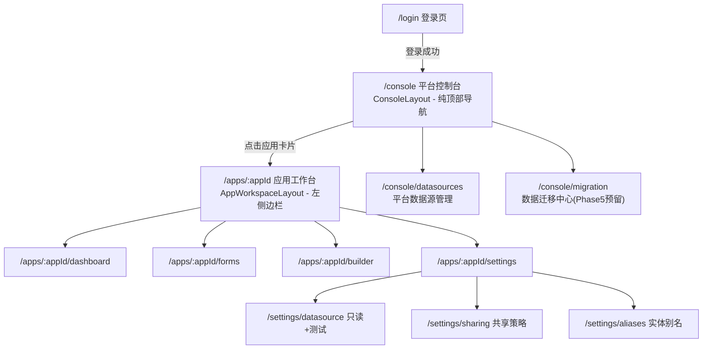
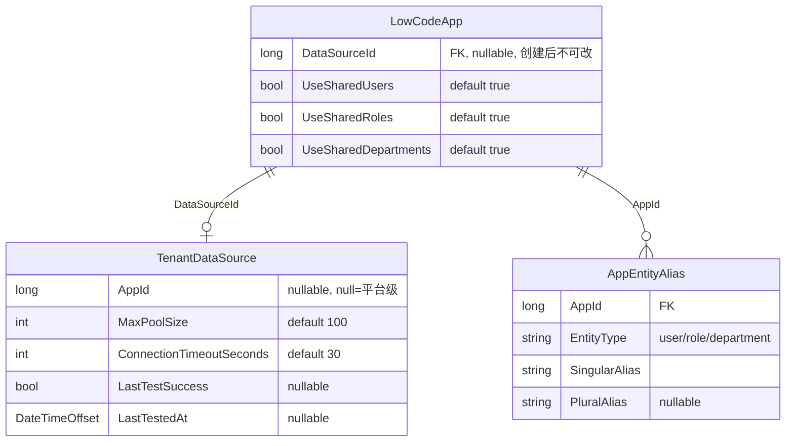

# 平台控制台与应用数据源 实施计划

## 架构流转




## 数据模型依赖




---

## Phase 1 — 后端：领域实体扩展

涉及文件：

- `[Atlas.Domain/LowCode/Entities/LowCodeApp.cs](src/backend/Atlas.Domain/LowCode/Entities/LowCodeApp.cs)`
- `[Atlas.Domain/System/Entities/TenantDataSource.cs](src/backend/Atlas.Domain/System/Entities/TenantDataSource.cs)`
- 新建 `Atlas.Domain/LowCode/Entities/AppEntityAlias.cs`
- `[Atlas.Infrastructure/Services/DatabaseInitializerHostedService.cs](src/backend/Atlas.Infrastructure/Services/DatabaseInitializerHostedService.cs)`

**T1.1** `LowCodeApp.cs` 构造函数增加 `long? dataSourceId`、`bool useSharedUsers = true`、`bool useSharedRoles = true`、`bool useSharedDepartments = true` 参数，对应属性 `private set`，无任何 Update 方法暴露 DataSourceId。

**T1.2** 新建 `AppEntityAlias.cs`，继承 `EntityBase`，字段：`AppId(long)`、`EntityType(string)`、`SingularAlias(string)`、`PluralAlias(string?)`，新增 `Update(singularAlias, pluralAlias)` 方法。

**T1.3** `TenantDataSource.cs` 新增 `AppId(long?)`、`MaxPoolSize(int=100)`、`ConnectionTimeoutSeconds(int=30)`、`LastTestSuccess(bool?)`、`LastTestedAt(DateTimeOffset?)` 属性，新增 `RecordTestResult(bool success)` 方法。

**T1.4** `DatabaseInitializerHostedService.cs` 在 `InitTables` 列表中加入 `typeof(AppEntityAlias)`。

---

## Phase 2 — 后端：应用层 DTO 与接口

涉及文件：

- `[Atlas.Application/LowCode/Models/LowCodeAppModels.cs](src/backend/Atlas.Application/LowCode/Models/LowCodeAppModels.cs)`
- `[Atlas.Application/LowCode/Abstractions/ILowCodeAppCommandService.cs](src/backend/Atlas.Application/LowCode/Abstractions/ILowCodeAppCommandService.cs)`
- `[Atlas.Application/LowCode/Abstractions/ILowCodeAppQueryService.cs](src/backend/Atlas.Application/LowCode/Abstractions/ILowCodeAppQueryService.cs)`

**T2.1** `LowCodeAppModels.cs` 修改与新增：

```csharp
// 修改：增加数据源与共享策略字段
record LowCodeAppCreateRequest(
    string AppKey, string Name, string? Description, string? Category, string? Icon,
    long? DataSourceId,              // 新增，创建时一次性绑定
    bool UseSharedUsers = true,      // 新增
    bool UseSharedRoles = true,      // 新增
    bool UseSharedDepartments = true // 新增
);

// 新增：共享策略 DTO
record AppSharingPolicyDto(bool UseSharedUsers, bool UseSharedRoles, bool UseSharedDepartments);
record AppSharingPolicyUpdateRequest(bool UseSharedUsers, bool UseSharedRoles, bool UseSharedDepartments);

// 新增：实体别名 DTO
record AppEntityAliasDto(string EntityType, string SingularAlias, string? PluralAlias);
record AppEntityAliasUpdateRequest(IReadOnlyList<AppEntityAliasDto> Aliases);

// 新增：应用数据源只读视图（脱敏，不含连接串）
record AppDataSourceView(string? DataSourceId, string? Name, string? DbType,
    bool? LastTestSuccess, DateTimeOffset? LastTestedAt);
```

**T2.2** `ILowCodeAppCommandService.cs` 新增：

```csharp
Task UpdateSharingPolicyAsync(TenantId tenantId, long appId,
    AppSharingPolicyUpdateRequest request, CancellationToken ct = default);
Task UpdateEntityAliasesAsync(TenantId tenantId, long appId,
    AppEntityAliasUpdateRequest request, CancellationToken ct = default);
```

**T2.3** `ILowCodeAppQueryService.cs` 新增：

```csharp
Task<AppDataSourceView?> GetAppDataSourceAsync(TenantId tenantId, long appId, CancellationToken ct = default);
Task<AppSharingPolicyDto?> GetSharingPolicyAsync(TenantId tenantId, long appId, CancellationToken ct = default);
Task<IReadOnlyList<AppEntityAliasDto>> GetEntityAliasesAsync(TenantId tenantId, long appId, CancellationToken ct = default);
```

---

## Phase 3 — 后端：基础设施层实现

涉及文件：

- `[Atlas.Infrastructure/Services/LowCodeAppCommandService.cs](src/backend/Atlas.Infrastructure/Services)`（按需定位）
- `[Atlas.Infrastructure/Services/LowCodeAppQueryService.cs](src/backend/Atlas.Infrastructure/Services)`（按需定位）
- `[Atlas.Infrastructure/Atlas.Infrastructure.csproj](src/backend/Atlas.Infrastructure/Atlas.Infrastructure.csproj)`

**T3.1** `LowCodeAppCommandService.cs`：

- `CreateAsync` 将 `request.DataSourceId`、`request.UseShared`* 传入 `LowCodeApp` 构造函数
- 实现 `UpdateSharingPolicyAsync`：查找实体，调用 `app.UpdateSharingPolicy(...)` 方法（需同步在实体中添加），保存
- 实现 `UpdateEntityAliasesAsync`：批量 Upsert `AppEntityAlias`（先按 `appId` 删除旧记录，再批量插入新记录，单次 DB 操作）

**T3.2** `LowCodeAppQueryService.cs`：

- 实现 `GetAppDataSourceAsync`：查 `LowCodeApp.DataSourceId`，再查 `TenantDataSource`，返回脱敏视图
- 实现 `GetSharingPolicyAsync`：直接从 `LowCodeApp` 返回三个 bool 字段
- 实现 `GetEntityAliasesAsync`：查 `AppEntityAlias WHERE AppId = appId`

**T3.3** `Atlas.Infrastructure.csproj` 添加：

```xml
<PackageReference Include="Microsoft.Data.SqlClient" Version="6.0.1" />
<PackageReference Include="MySqlConnector" Version="2.4.0" />
<PackageReference Include="Npgsql" Version="9.0.4" />
```

---

## Phase 4 — 后端：API 层与 HTTP 测试

涉及文件：

- `[Atlas.WebApi/Controllers/LowCodeAppsController.cs](src/backend/Atlas.WebApi/Controllers/LowCodeAppsController.cs)`（按需定位）
- `[Atlas.WebApi/Bosch.http/LowCodeApps.http](src/backend/Atlas.WebApi/Bosch.http/LowCodeApps.http)`

**T4.1** `LowCodeAppsController.cs` 新增 6 个端点：

```
GET  /{id:long}/datasource              → GetAppDataSourceAsync（只读，脱敏）
POST /{id:long}/datasource/test         → TestConnectionAsync（复用已有服务）
GET  /{id:long}/sharing-policy          → GetSharingPolicyAsync
PUT  /{id:long}/sharing-policy          → UpdateSharingPolicyAsync（需 Idempotency-Key + X-CSRF-TOKEN）
GET  /{id:long}/entity-aliases          → GetEntityAliasesAsync
PUT  /{id:long}/entity-aliases          → UpdateEntityAliasesAsync（需 Idempotency-Key + X-CSRF-TOKEN）
```

`PUT` 端点 DTO 中不含 `DataSourceId`，从接口层物理隔离不可变约束。

**T4.2** `LowCodeApps.http` 补充以上 6 个端点的测试用例。

---

## Phase 5 — 前端：布局组件

涉及文件（均新建）：

- `src/frontend/Atlas.WebApp/src/layouts/ConsoleLayout.vue`
- `src/frontend/Atlas.WebApp/src/layouts/AppWorkspaceLayout.vue`
- 修改 `[src/layouts/MainLayout.vue](src/frontend/Atlas.WebApp/src/layouts/MainLayout.vue)`

**T5.1** 新建 `ConsoleLayout.vue`：顶部横向导航，包含 Logo、Tab 链接（应用/数据源/设置）、用户下拉（个人中心/退出），内容区用 `<router-view />`，无侧边栏、无 TagsView。

**T5.2** 新建 `AppWorkspaceLayout.vue`：左侧 220px 边栏（显示应用名 + 返回控制台链接 + 应用专属菜单），顶部栏（面包屑+用户下拉），内容区 `<router-view />`。侧边菜单为**静态配置**（仪表盘/表单/低代码设计器/审批/工作流/设置），不依赖后端动态菜单，路径均带 `/apps/:appId` 前缀。

**T5.3** `MainLayout.vue` 中 `isAuthPage` 的判断扩展为：

```typescript
const isAuthPage = computed(() =>
  route.path === "/login" ||
  route.path === "/register" ||
  route.path.startsWith("/console") ||   // 新增
  route.path.startsWith("/apps/")        // 新增
);
```

（ConsoleLayout 和 AppWorkspaceLayout 各自是独立的 layout 组件，不走 MainLayout 内的侧边栏渲染）

---

## Phase 6 — 前端：路由重构

涉及文件：

- `[src/router/index.ts](src/frontend/Atlas.WebApp/src/router/index.ts)`
- `[src/pages/LoginPage.vue](src/frontend/Atlas.WebApp/src/pages/LoginPage.vue)`

**T6.1** `router/index.ts` 添加两个 layout 路由组：

```typescript
// 平台控制台路由组
{
  path: "/console",
  component: ConsoleLayout,
  children: [
    { path: "", name: "console-apps", component: ConsolePage, meta: { requiresAuth: true, title: "应用控制台" } },
    { path: "datasources", name: "console-datasources", component: ConsoleDatasourcesPage, meta: { requiresAuth: true } },
    { path: "settings/users", ... },
    // 其他 console 子路由
  ]
},
// 应用工作台路由组
{
  path: "/apps/:appId",
  component: AppWorkspaceLayout,
  children: [
    { path: "dashboard", name: "app-dashboard", component: AppDashboardPage, meta: { requiresAuth: true } },
    { path: "forms", ... },
    { path: "builder", ... },
    { path: "settings/datasource", name: "app-settings-datasource", component: AppDatasourcePage },
    { path: "settings/sharing", name: "app-settings-sharing", component: AppSharingPolicyPage },
    { path: "settings/aliases", name: "app-settings-aliases", component: AppEntityAliasPage },
  ]
},
```

保留 `/lowcode/apps` 路由作为 legacy redirect → `/console`。

**T6.2** `LoginPage.vue` 第 411 行，将 `fallbackPath` 默认值从 `"/profile"` 改为 `"/console"`；同时 `router/index.ts` 中已登录访问 `/login` 时跳转 `/console`（原为 `/profile`）。

---

## Phase 7 — 前端：类型与服务

涉及文件：

- `[src/types/lowcode.ts](src/frontend/Atlas.WebApp/src/types/lowcode.ts)`（按需定位）
- `[src/services/lowcode.ts](src/frontend/Atlas.WebApp/src/services/lowcode.ts)`（按需定位）

**T7.1** `types/lowcode.ts` 新增：

```typescript
interface LowCodeAppCreateRequest {  // 修改：原有字段保留，新增
  dataSourceId?: string
  useSharedUsers?: boolean  // default true
  useSharedRoles?: boolean
  useSharedDepartments?: boolean
}

interface AppDataSourceView {
  dataSourceId?: string; name?: string; dbType?: string
  lastTestSuccess?: boolean; lastTestedAt?: string
}
interface AppSharingPolicy { useSharedUsers: boolean; useSharedRoles: boolean; useSharedDepartments: boolean }
interface AppEntityAlias { entityType: string; singularAlias: string; pluralAlias?: string }
```

**T7.2** `services/lowcode.ts` 新增 6 个函数：

```typescript
getAppDatasource(appId: string): Promise<AppDataSourceView>
testAppDatasource(appId: string): Promise<TestConnectionResult>
getAppSharingPolicy(appId: string): Promise<AppSharingPolicy>
updateAppSharingPolicy(appId: string, policy: AppSharingPolicy): Promise<void>
getAppEntityAliases(appId: string): Promise<AppEntityAlias[]>
updateAppEntityAliases(appId: string, aliases: AppEntityAlias[]): Promise<void>
```

---

## Phase 8 — 前端：平台控制台页面

涉及文件（新建）：

- `src/pages/console/ConsolePage.vue`

**T8.1** 新建 `ConsolePage.vue`：将 `AppListPage.vue` 的应用卡片网格逻辑提取复用（或直接嵌入），「新建应用」按钮触发三步向导（下一 Phase 实现），点击应用卡片 `router.push('/apps/' + app.id + '/dashboard')`。

---

## Phase 9 — 前端：应用创建向导（核心改造）

涉及文件：

- `[src/pages/lowcode/AppListPage.vue](src/frontend/Atlas.WebApp/src/pages/lowcode/AppListPage.vue)` 或新建 `AppCreateWizard.vue` 组件

**T9.1** 将 `handleCreate` 触发的 `<a-modal>` 替换为 `<a-modal>` 内嵌 `<a-steps>`，3 步流程：

- **步骤 1（基本信息）**：AppKey、Name、Description、Category、Icon
- **步骤 2（绑定数据源）**：
  - 三选一单选：「平台默认」 / 「选择已有数据源（下拉，20条+搜索）」/ 「创建新数据源」
  - 创建新数据源时，DbType 下拉（SQLite/SQL Server/MySQL/PostgreSQL），按类型动态渲染连接参数表单
  - 「测试连接」按钮，测试通过后才能「下一步」（若选平台默认或已有数据源则直接可过）
  - 页面顶部固定警告条：`⚠️ 数据源绑定后不可更改，请谨慎选择`
- **步骤 3（共享策略与别名）**：3 个 Switch + 别名输入组（可选），若 UseSharedXxx = false 则校验 DataSourceId 非空

提交时调用更新后的 `createLowCodeApp()`（包含 `dataSourceId`、`useShared`*）。

---

## Phase 10 — 前端：应用工作台页面

涉及文件（均新建）：

- `src/pages/apps/AppDashboardPage.vue`
- `src/pages/apps/settings/AppDatasourcePage.vue`
- `src/pages/apps/settings/AppSharingPolicyPage.vue`
- `src/pages/apps/settings/AppEntityAliasPage.vue`

**T10.1** `AppDashboardPage.vue`：简单展示应用基本信息卡片（名称、状态、AppKey、数据源状态）。

**T10.2** `AppDatasourcePage.vue`：调用 `getAppDatasource(appId)`，以只读表单展示数据源信息（DbType、服务器、数据库名、状态），「重新测试连接」按钮调用 `testAppDatasource(appId)`，所有输入框 `disabled`，锁形图标标注。

**T10.3** `AppSharingPolicyPage.vue`：3 个 `<a-switch>` 绑定 useShared* 字段，「保存」时调用 `updateAppSharingPolicy()`，切换为独立时显示内联警告文案。

**T10.4** `AppEntityAliasPage.vue`：3 行表格（user/role/department），每行两个输入框（单数别名、复数别名），「保存」时调用 `updateAppEntityAliases()`。

---

## 文件变更汇总

**后端新建（2个）**

- `Atlas.Domain/LowCode/Entities/AppEntityAlias.cs`

**后端修改（7个）**

- `LowCodeApp.cs` — 新增字段（Phase 1）
- `TenantDataSource.cs` — 新增字段（Phase 1）
- `DatabaseInitializerHostedService.cs` — InitTables（Phase 1）
- `LowCodeAppModels.cs` — DTO 扩展（Phase 2）
- `ILowCodeAppCommandService.cs` / `ILowCodeAppQueryService.cs` — 接口扩展（Phase 2）
- `LowCodeAppCommandService.cs` / `LowCodeAppQueryService.cs` — 实现（Phase 3）
- `Atlas.Infrastructure.csproj` — NuGet 包（Phase 3）
- `LowCodeAppsController.cs` — 新端点（Phase 4）
- `LowCodeApps.http` — 测试用例（Phase 4）

**前端新建（8个）**

- `layouts/ConsoleLayout.vue`
- `layouts/AppWorkspaceLayout.vue`
- `pages/console/ConsolePage.vue`
- `pages/apps/AppDashboardPage.vue`
- `pages/apps/settings/AppDatasourcePage.vue`
- `pages/apps/settings/AppSharingPolicyPage.vue`
- `pages/apps/settings/AppEntityAliasPage.vue`

**前端修改（4个）**

- `layouts/MainLayout.vue` — isAuthPage 扩展
- `router/index.ts` — 新路由组
- `pages/LoginPage.vue` — 默认跳转
- `pages/lowcode/AppListPage.vue` — 向导升级
- `services/lowcode.ts` + `types/lowcode.ts` — 类型与服务

