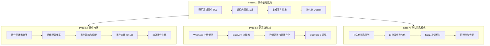
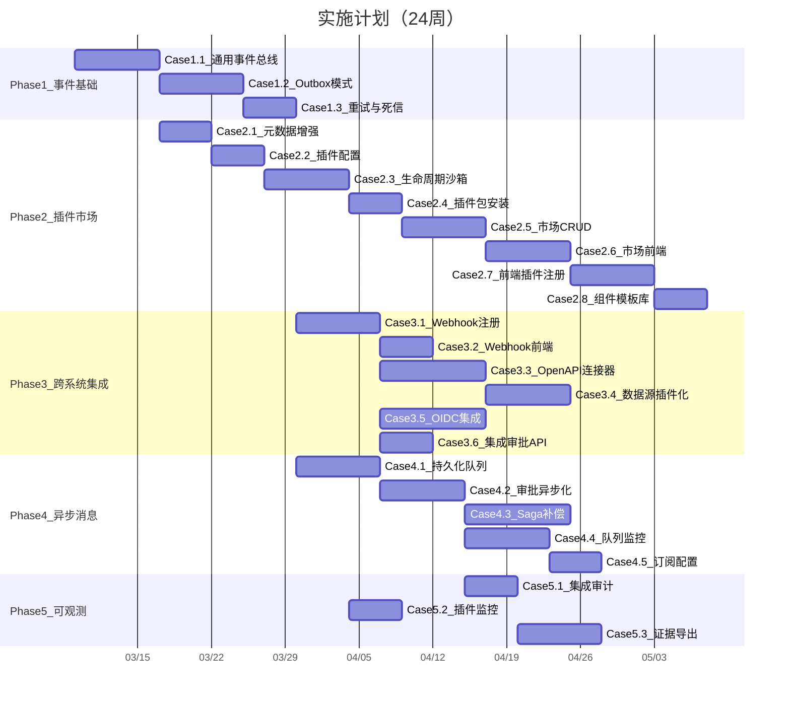

# 平台化生态、跨系统集成、异步消息模式实施计划

## 现状分析

### 已有基础设施

| 能力  | 现有实现 | 缺口  |
| --- | ---- | --- |

- **插件骨架**: `[IAtlasPlugin](src/backend/Atlas.Core/Plugins/IAtlasPlugin.cs)` (Code/Name/Version/生命周期)、`[IPluginCatalogService](src/backend/Atlas.Application/Plugins/Abstractions/IPluginCatalogService.cs)` (目录/重载)、`[PluginDescriptor](src/backend/Atlas.Application/Plugins/Models/PluginModels.cs)`、`PluginsController` -- 缺：插件市场、插件配置、依赖管理、沙箱隔离、前端插件体系
- **事件发布**: `[ApprovalEventPublisher](src/backend/Atlas.Infrastructure/Services/ApprovalFlow/ApprovalEventPublisher.cs)` (进程内遍历 handler) -- 缺：通用领域事件总线、集成事件、持久化/重试、跨进程分发
- **外部回调**: `[IExternalCallbackHandler](src/backend/Atlas.Application.Approval/Abstractions/IExternalCallbackHandler.cs)` + `HttpCallbackHandler` -- 缺：Webhook 注册管理、签名验证框架、通用回调调度
- **后台队列**: `[IBackgroundWorkQueue](src/backend/Atlas.Core/Abstractions/IBackgroundWorkQueue.cs)` -- 缺：持久化消息队列、死信处理、可观测

### 架构演进目标

---

## Phase 1: 事件基础设施 (基石层)

所有后续能力都依赖统一的事件机制，必须最先实施。

### Case 1.1: 通用领域事件接口与进程内事件总线

**目标**: 建立 `IDomainEvent` + `IDomainEventHandler<T>` + `IEventBus` 抽象，替代审批流中的硬编码 Publisher 模式，使所有有界上下文都能发布/订阅事件。

**后端实现**:

- 在 `[Atlas.Core/Events/](src/backend/Atlas.Core/)` 新增:
  - `IDomainEvent` (EventId, OccurredAt, TenantId)
  - `IDomainEventHandler<TEvent>` (HandleAsync)
  - `IEventBus` (PublishAsync)
- 在 `[Atlas.Infrastructure/Events/](src/backend/Atlas.Infrastructure/)` 新增:
  - `InProcessEventBus` : IEventBus -- 从 DI 容器解析所有 handler 并顺序执行
- 在 `[Atlas.Infrastructure/ServiceCollectionExtensions.cs](src/backend/Atlas.Infrastructure/ServiceCollectionExtensions.cs)` 注册
- 迁移现有 `ApprovalEventPublisher` 为 `IDomainEventHandler` 适配器（保持向后兼容）

**验收**: 单元测试证明事件发布后所有 handler 被调用；审批流功能不退化。

---

### Case 1.2: 集成事件抽象与 Outbox 模式

**目标**: 区分领域事件（进程内）与集成事件（跨边界），引入 Outbox 表保证"至少一次"投递。

**后端实现**:

- `Atlas.Core/Events/IIntegrationEvent.cs` 继承 IDomainEvent，增加 EventType/Payload 序列化
- `Atlas.Domain/Events/OutboxMessage.cs` 实体 (Id, EventType, Payload, CreatedAt, ProcessedAt, RetryCount, Status)
- `Atlas.Application/Events/IOutboxRepository.cs`
- `Atlas.Infrastructure/Events/OutboxRepository.cs` (SqlSugar)
- `Atlas.Infrastructure/Events/OutboxPublisher.cs` -- 事务内写 Outbox；后台 HostedService 轮询投递
- `OutboxProcessorHostedService` -- 定时扫描未处理消息，分发给 handler 或外部目标

**验收**: 审批通过事件写入 Outbox，后台服务投递成功并标记 ProcessedAt。

---

### Case 1.3: 事件重试与死信机制

**目标**: Outbox 投递失败时自动重试（指数退避），超过阈值进入死信。

**后端实现**:

- `OutboxMessage` 增加 MaxRetries, NextRetryAt, ErrorMessage 字段
- `OutboxProcessorHostedService` 加入重试逻辑、指数退避（1s/5s/30s/5m/30m）
- 死信状态 `DeadLettered`，提供手动重试 API
- 在 `SystemConfigsController` 或新建 `EventsController` 中暴露死信查询/重试端点
- `.http` 测试文件

**验收**: 模拟 handler 抛异常，验证重试 5 次后进入死信；手动重试可恢复。

---

## Phase 2: 平台化生态 -- 插件市场

### Case 2.1: 插件元数据增强

**目标**: 扩展现有 `IAtlasPlugin` 和 `PluginDescriptor`，支持分类、描述、作者、图标、依赖声明、权限声明。

**后端实现**:

- 扩展 `[IAtlasPlugin](src/backend/Atlas.Core/Plugins/IAtlasPlugin.cs)`:
  - 新增 `Description`、`Author`、`IconUrl`、`Category`（枚举: FieldType/Validator/DataSource/FlowNode/GridRenderer/Theme）
  - 新增 `Dependencies` (IReadOnlyList)
  - 新增 `RequiredPermissions` (IReadOnlyList)
- `PluginDependency` record (Code, MinVersion, MaxVersion)
- 更新 `[PluginDescriptor](src/backend/Atlas.Application/Plugins/Models/PluginModels.cs)` 同步新字段
- 更新 `PluginsController` GET 端点返回新字段

**验收**: 内置插件（如 DynamicTableApprovalEventHandler）可通过 API 查看完整元数据。

---

### Case 2.2: 插件配置体系

**目标**: 每个插件可声明自己的配置 Schema，租户/应用级可存储不同配置值。

**后端实现**:

- `IAtlasPlugin` 新增 `ConfigSchema` 属性 (JSON Schema 字符串)
- `Atlas.Domain/Plugins/PluginConfig.cs` 实体 (TenantEntity): PluginCode, Scope(Global/Tenant/App), ScopeId, ConfigJson, UpdatedAt
- `IPluginConfigRepository` + SqlSugar 实现
- `IPluginConfigService` (GetConfig/SaveConfig/ValidateConfig)
- `PluginsController` 新增 GET/PUT `api/v1/plugins/{code}/config` 端点
- `.http` 测试文件

**验收**: 为某插件保存租户级配置，读取时按 scope 优先级合并（Global < Tenant < App）。

---

### Case 2.3: 插件生命周期管理与沙箱

**目标**: 插件启用/禁用/卸载流程，AssemblyLoadContext 隔离。

**后端实现**:

- `IPluginCatalogService` 新增: `EnableAsync`, `DisableAsync`, `UnloadAsync`, `InstallFromPackageAsync`
- `PluginCatalogService` 实现 AssemblyLoadContext 管理:
  - 每个插件独立 LoadContext
  - 卸载时 Unload Context
  - 加载前校验依赖（版本兼容性）
- `PluginDescriptor` 增加 State 枚举 (Installed/Enabled/Disabled/Error/Unloaded)
- `PluginsController` 新增 POST `api/v1/plugins/{code}/enable`, POST `api/v1/plugins/{code}/disable`
- 审计日志: 插件启用/禁用/安装/卸载操作留痕

**验收**: 禁用插件后其 handler 不再被事件总线调用；重新启用后恢复。

---

### Case 2.4: 插件包格式与安装

**目标**: 定义 `.atpkg` 插件包格式（ZIP），支持上传安装。

**后端实现**:

- 插件包结构: `manifest.json` (元数据) + `lib/` (DLL) + `assets/` (前端资源) + `config-schema.json`
- `PluginPackageService`: 解压、校验 manifest、校验签名（可选）、复制到插件目录
- `PluginsController` 新增 POST `api/v1/plugins/install` (multipart 上传)
- 安装后自动触发 `ReloadAsync`

**验收**: 上传一个示例插件包，安装成功后出现在插件列表。

---

### Case 2.5: 插件市场 -- 后端 CRUD

**目标**: 插件市场的"发布/搜索/详情/版本历史"后端。

**后端实现**:

- `Atlas.Domain/Plugins/PluginMarketEntry.cs` (TenantEntity): Code, Name, Description, Author, Category, LatestVersion, Downloads, Rating, IconUrl, PackageUrl, PublishedAt, Status(Draft/Published/Deprecated)
- `Atlas.Domain/Plugins/PluginMarketVersion.cs`: EntryId, Version, ReleaseNotes, PackageHash, PublishedAt
- 仓储 + Query/Command 服务
- `PluginMarketController`:
  - GET `api/v1/plugin-market` (分页搜索，按 category/keyword 筛选)
  - GET `api/v1/plugin-market/{code}` (详情)
  - GET `api/v1/plugin-market/{code}/versions` (版本历史)
  - POST `api/v1/plugin-market` (发布/提交审核)
  - PUT `api/v1/plugin-market/{code}` (更新)
- `.http` 测试文件

**验收**: 能发布插件到市场、搜索、查看详情和版本历史。

---

### Case 2.6: 插件市场 -- 前端页面

**目标**: 插件市场浏览/安装/管理的前端 UI。

**前端实现**:

- `src/pages/lowcode/PluginMarketPage.vue`: 卡片式插件列表（分类筛选、搜索）
- `src/pages/lowcode/PluginDetailPage.vue`: 插件详情（描述/截图/版本/安装）
- `src/pages/system/PluginManagePage.vue`: 已安装插件管理（启用/禁用/配置/卸载）
- `src/services/plugin.ts`: 插件市场 API 客户端
- `src/types/plugin.ts`: TypeScript 类型
- 路由注册

**验收**: 可浏览市场、安装插件、在管理页配置和启用/禁用。

---

### Case 2.7: 前端插件扩展点 -- 组件注册表

**目标**: 前端支持动态注册自定义字段类型、渲染器、验证器。

**前端实现**:

- `src/plugins/registry.ts`: 组件注册表
  - `registerFieldRenderer(type, component)`
  - `registerValidator(name, fn)`
  - `registerGridCellRenderer(type, component)`
  - `getFieldRenderer(type)` / `getValidator(name)` / etc.
- `src/plugins/loader.ts`: 从后端加载插件前端资源（JS bundle），执行注册
- `src/composables/usePluginRegistry.ts`: 组合式函数

**验收**: 通过注册表动态注册一个自定义字段类型，表单渲染器能正确渲染。

---

### Case 2.8: 组件模板库

**目标**: 可复用的表单模板、页面模板、流程模板。

**后端实现**:

- `Atlas.Domain/Templates/` 新增:
  - `ComponentTemplate.cs` (TenantEntity): Name, Category(Form/Page/Flow/Grid), SchemaJson, Description, Tags, IsBuiltIn, Version
- 仓储 + Query/Command 服务
- `TemplatesController`:
  - GET `api/v1/templates` (分页，按 category 筛选)
  - GET `api/v1/templates/{id}`
  - POST `api/v1/templates` (创建)
  - POST `api/v1/templates/{id}/instantiate` (从模板创建实例)
- `.http` 测试文件

**前端实现**:

- 设计器中"从模板创建"入口
- 模板浏览/预览弹窗

**验收**: 从模板创建表单/页面，内容正确继承。

---

## Phase 3: 跨系统集成

### Case 3.1: Webhook 注册管理

**目标**: 外部系统可注册 Webhook 订阅平台事件，替代硬编码的回调配置。

**后端实现**:

- `Atlas.Domain/Integration/WebhookSubscription.cs` (TenantEntity): Name, EventTypes(JSON array), TargetUrl, Secret, Headers, IsActive, CreatedAt, LastTriggeredAt
- `Atlas.Domain/Integration/WebhookDeliveryLog.cs`: SubscriptionId, EventType, Payload, ResponseCode, ResponseBody, Duration, CreatedAt
- 仓储 + 服务
- `WebhooksController`:
  - CRUD `api/v1/webhooks` (注册/更新/删除/列表)
  - GET `api/v1/webhooks/{id}/deliveries` (投递记录)
  - POST `api/v1/webhooks/{id}/test` (测试投递)
- `WebhookDispatcher`: 监听集成事件，匹配订阅，异步 HTTP 投递
  - HMAC-SHA256 签名 (`X-Atlas-Signature`)
  - 投递失败自动重试（复用 Outbox 机制）
- `.http` 测试文件

**验收**: 注册 Webhook 后，审批通过事件触发 HTTP 回调，签名可验证。

---

### Case 3.2: Webhook 前端管理

**目标**: Webhook 订阅的前端 CRUD 和投递日志查看。

**前端实现**:

- `src/pages/system/WebhooksPage.vue`: Webhook 列表/创建/编辑
- 投递日志 Drawer（按订阅查看历史投递及状态）
- `src/services/webhook.ts` + `src/types/webhook.ts`

**验收**: 可在 UI 上创建 Webhook、查看投递记录、测试投递。

---

### Case 3.3: OpenAPI 连接器框架

**目标**: 支持通过 OpenAPI/Swagger 定义连接外部 REST API，作为数据源或操作目标。

**后端实现**:

- `Atlas.Domain/Integration/ApiConnector.cs` (TenantEntity): Name, BaseUrl, AuthType(None/ApiKey/Bearer/OAuth2), AuthConfig(JSON), OpenApiSpecUrl, HealthCheckUrl, Timeout, IsActive
- `Atlas.Domain/Integration/ApiConnectorOperation.cs`: ConnectorId, OperationId, Method, Path, Description, RequestSchema, ResponseSchema
- `IApiConnectorService`:
  - `SyncFromSpecAsync(connectorId)` -- 从 OpenAPI spec 同步操作列表
  - `ExecuteAsync(connectorId, operationId, parameters)` -- 代理执行
  - `HealthCheckAsync(connectorId)`
- `ApiConnectorsController`:
  - CRUD `api/v1/connectors`
  - POST `api/v1/connectors/{id}/sync` (同步 spec)
  - POST `api/v1/connectors/{id}/operations/{opId}/execute` (执行)
  - GET `api/v1/connectors/{id}/health`
- `.http` 测试文件

**验收**: 导入一个外部 API 的 OpenAPI spec，同步操作列表，执行一个操作并返回结果。

---

### Case 3.4: 数据源连接器插件化

**目标**: 将现有 `TenantDataSource` 扩展为可插件化的连接器体系。

**后端实现**:

- `IDataSourceConnector` 插件接口 (继承 IAtlasPlugin):
  - `TestConnectionAsync`, `GetSchemaAsync`, `QueryAsync`, `ExecuteAsync`
- 内置连接器: SQLite/MySQL/PostgreSQL/SQLServer (基于现有 `TenantDataSourceService`)
- 连接器注册到插件目录
- 低代码页面/表单设计器可选择数据源连接器作为数据来源

**验收**: 通过插件机制加载 MySQL 连接器，低代码表单可绑定外部 MySQL 数据源。

---

### Case 3.5: SSO/OIDC 集成适配

**目标**: 支持 OIDC 协议对接企业 IdP，用户信息同步到表达式上下文。

**后端实现**:

- `Atlas.Infrastructure/Security/OidcAuthenticationHandler.cs`
- appsettings 新增 `Oidc` 配置节 (Authority, ClientId, ClientSecret, Scopes)
- 登录流程支持 OIDC 重定向 + 本地 JWT 映射
- 用户首次 OIDC 登录自动创建/关联本地账号
- OIDC claims 映射到 `ICurrentUserAccessor` 的角色/部门/项目

**验收**: 配置 OIDC IdP 后，外部用户可登录并自动映射角色权限。

---

### Case 3.6: 跨系统审批集成 API

**目标**: 提供标准化 API 供外部系统发起审批、查询状态、接收回调。

**后端实现**:

- `IntegrationApprovalController` (api/v1/integration/approvals):
  - POST `/start` -- 外部系统发起审批 (携带 callbackUrl)
  - GET `/{instanceId}/status` -- 查询审批状态
  - POST `/{instanceId}/cancel` -- 取消审批
- 审批完成时自动通过 Webhook/回调通知外部系统
- API Key 认证方式（区别于用户 JWT）
- 限流控制

**验收**: 外部系统通过 API Key 发起审批，审批完成后收到回调。

---

## Phase 4: 异步消息模式

### Case 4.1: 持久化消息队列服务

**目标**: 基于 SQLite 的轻量级持久化消息队列（不引入 RabbitMQ 等外部依赖）。

**后端实现**:

- `Atlas.Core/Messaging/IMessageQueue.cs`:
  - `EnqueueAsync(queueName, message)` -- 入队
  - `DequeueAsync(queueName, count)` -- 出队
  - `AcknowledgeAsync(messageId)` -- 确认
  - `RejectAsync(messageId, requeue)` -- 拒绝/重入队
- `Atlas.Domain/Messaging/QueueMessage.cs` 实体: QueueName, MessageType, Payload, Status(Pending/Processing/Completed/Failed/DeadLettered), EnqueuedAt, ProcessingStartedAt, CompletedAt, RetryCount, ErrorMessage
- `Atlas.Infrastructure/Messaging/SqliteMessageQueue.cs` -- SqlSugar 实现
- `MessageQueueProcessorHostedService` -- 后台轮询消费
- `Atlas.Infrastructure/DependencyInjection/MessagingServiceRegistration.cs`

**验收**: 入队消息 -> 后台消费 -> 确认完成；消费失败重试后进入死信。

---

### Case 4.2: 审批事件异步化

**目标**: 将审批流事件发布从同步遍历 handler 改为"写入消息队列 + 异步消费"。

**后端实现**:

- 新增 `ApprovalEventMessage` 消息类型
- `ApprovalEventPublisher` 改造:
  - 发布事件时写入 MessageQueue (queueName: "approval-events")
  - 不再同步调用 handler
- `ApprovalEventConsumer` : HostedService
  - 从队列消费消息
  - 解析事件类型，分发给对应 handler
  - 消费成功 Acknowledge，失败 Reject+重试
- 配置项 `Messaging.ApprovalEvents.Enabled` 控制是否启用异步模式（渐进式迁移）

**验收**: 审批通过后事件异步消费，动态表状态回写正常；回写失败可重试。

---

### Case 4.3: Saga 编排与补偿机制

**目标**: 为"表单提交 -> 审批发起 -> 状态回写"链路提供 Saga 补偿。

**后端实现**:

- `Atlas.Core/Saga/ISagaStep.cs`: ExecuteAsync, CompensateAsync
- `Atlas.Core/Saga/ISagaOrchestrator.cs`: RunAsync(steps[])
- `Atlas.Domain/Saga/SagaInstance.cs` 实体: SagaId, CurrentStep, Status(Running/Completed/Compensating/Failed), Steps(JSON), CreatedAt
- `Atlas.Infrastructure/Saga/SagaOrchestrator.cs`:
  - 顺序执行步骤
  - 任一步骤失败触发反向补偿
  - 每步状态持久化（可恢复）
- 审批发起 Saga: SubmitRecord -> StartInstance -> UpdateRecordStatus
  - 补偿: RevertRecordStatus -> CancelInstance

**验收**: 审批发起流程中第 3 步失败时，前 2 步自动补偿回滚。

---

### Case 4.4: 消息队列监控与管理

**目标**: 提供消息队列的运维可观测能力。

**后端实现**:

- `MessageQueueController` (api/v1/admin/message-queue):
  - GET `/queues` -- 队列列表及统计 (pending/processing/failed/dead)
  - GET `/queues/{name}/messages` -- 按队列查看消息 (分页)
  - POST `/queues/{name}/dead-letters/retry` -- 批量重试死信
  - DELETE `/queues/{name}/dead-letters` -- 清理死信
  - GET `/stats` -- 全局统计（吞吐量/延迟/错误率）
- `.http` 测试文件

**前端实现**:

- `src/pages/monitor/MessageQueuePage.vue`: 队列监控仪表板
  - 队列列表 + 消息数统计
  - 死信消息查看/重试
  - 消费延迟图表

**验收**: 可在 UI 上看到各队列消息数、死信数，支持批量重试。

---

### Case 4.5: 事件订阅与过滤配置

**目标**: 允许租户/应用级配置事件订阅规则（哪些事件发送到哪些队列/Webhook）。

**后端实现**:

- `Atlas.Domain/Events/EventSubscription.cs` (TenantEntity): Name, EventTypePattern (正则/通配符), TargetType(Queue/Webhook/Handler), TargetConfig(JSON), FilterExpression, IsActive
- `IEventSubscriptionService`: CRUD + Match 逻辑
- `EventRouter`: 事件发布时查询匹配的订阅，路由到对应目标
- `EventSubscriptionsController`: CRUD `api/v1/event-subscriptions`
- `.http` 测试文件

**验收**: 配置规则"审批通过事件 -> Webhook A + 队列 B"，两个目标都收到事件。

---

## Phase 5: 全量可观测与治理

### Case 5.1: 集成事件审计日志

**目标**: 所有集成事件（发布/消费/回调/失败）自动记录审计日志。

**后端实现**:

- 事件总线中间件: 发布前/后写入审计
- 消息消费前/后写入审计
- Webhook 投递结果写入审计
- 与现有 `IAuditWriter` 整合，EventType 标记为 `Integration.`*

**验收**: 审计日志中可检索所有集成事件的完整轨迹。

---

### Case 5.2: 插件运行时监控

**目标**: 监控插件的健康状态、调用次数、错误率。

**后端实现**:

- `PluginMetrics` 内存计数器: 调用次数/错误次数/平均耗时
- `PluginsController` 新增 GET `api/v1/plugins/{code}/metrics`
- 插件执行超时自动降级/熔断
- 定期健康检查（调用 IAtlasPlugin 的可选 HealthCheck 方法）

**前端实现**:

- 插件管理页增加运行时指标展示

**验收**: 插件频繁出错时自动禁用，管理页显示错误率和调用量。

---

### Case 5.3: 证据链自动化导出

**目标**: 一键导出集成事件链路的完整证据（审计日志+消息轨迹+Webhook投递记录）。

**后端实现**:

- `EvidenceExportService`: 按时间范围/事件类型/业务 Key 聚合证据
- 导出格式: JSON + PDF（用于等保审计）
- `EvidenceController` POST `api/v1/admin/evidence/export`

**验收**: 导出某笔审批的完整集成事件链路，包含时间线、状态变更、回调结果。

---

## 实施优先级与依赖关系

## 关键技术决策

- **消息队列**: 采用 SQLite 持久化队列（与现有技术栈一致），不引入外部 MQ 依赖；未来可通过插件适配 RabbitMQ/Kafka
- **事件总线**: 进程内 + Outbox 模式，保证最终一致性；不依赖分布式事件总线
- **插件隔离**: AssemblyLoadContext 隔离（已有骨架），逐步增强权限沙箱
- **向后兼容**: 所有异步化改造提供开关（appsettings），可渐进式迁移
- **等保合规**: 所有集成操作留审计痕迹，Webhook 签名防篡改，插件权限声明制

