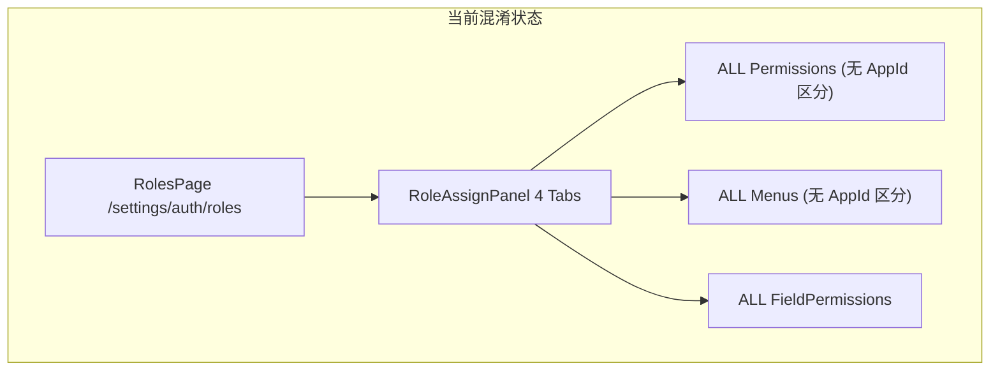
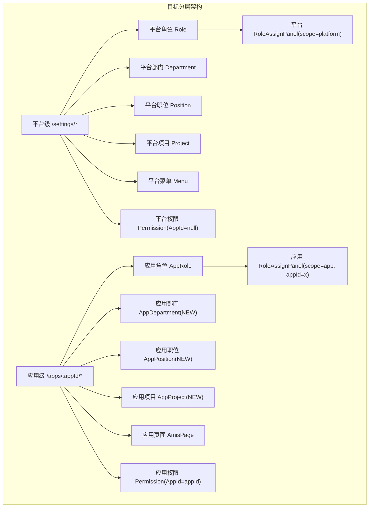

# 平台级与应用级能力分离架构方案

## 现状分析

## 分阶段实施计划

### Phase 1：后端数据模型扩展（3 个新实体 + 2 个实体加字段）

**涉及文件：**

- `[src/backend/Atlas.Domain/Identity/Entities/](src/backend/Atlas.Domain/Identity/Entities/)` — Permission、FieldPermission 加 `AppId?`
- `[src/backend/Atlas.Domain/Platform/Entities/AppMembershipEntities.cs](src/backend/Atlas.Domain/Platform/Entities/AppMembershipEntities.cs)` — AppRole 加 `DataScope` + `DeptIds`
- 新增：`Atlas.Domain/Platform/Entities/AppOrgEntities.cs` — `AppDepartment`、`AppPosition`、`AppProject`

关键字段扩展：

- `Permission.AppId long?` — null=平台级，有值=应用级
- `FieldPermission.AppId long?` — 同上
- `AppRole.DataScope DataScopeType` + `AppRole.DeptIds string?` — 应用角色支持数据范围

新实体（均继承 `TenantEntity`）：

- `AppDepartment`：AppId、Name、Code、ParentId?、SortOrder
- `AppPosition`：AppId、Name、Code、Description?、IsActive、SortOrder
- `AppProject`：AppId、Code、Name、Description?、IsActive

### Phase 2：后端 API 分层（平台 API 过滤 + 新增应用级 API）

**平台侧修改：**

- `GET /api/v1/permissions` → 增加 `AppId IS NULL` 过滤
- `GET /api/v1/field-permissions/{tableKey}` → 增加 `AppId IS NULL` 过滤

**新增应用级 API（`/api/v2/tenant-app-instances/{appId}/`）：**

| 路由                                         | 说明                         |
| ------------------------------------------ | -------------------------- |
| `permissions` CRUD                         | 应用级功能权限管理                  |
| `departments` CRUD                         | 应用级部门管理                    |
| `positions` CRUD                           | 应用级职位管理                    |
| `projects` CRUD                            | 应用级项目管理                    |
| `roles/{roleId}/permissions` GET/PUT       | 应用角色功能权限分配                 |
| `roles/{roleId}/pages` GET/PUT             | 应用角色页面分配（替代菜单）             |
| `roles/{roleId}/field-permissions` GET/PUT | 应用角色字段权限                   |
| `roles/{roleId}/data-scope` GET/PUT        | 应用角色数据范围（引用 AppDepartment） |

**涉及控制器：**

- `[src/backend/Atlas.WebApi/Controllers/PermissionsController.cs](src/backend/Atlas.WebApi/Controllers/PermissionsController.cs)` — 加 AppId 过滤
- 新增：`TenantAppPermissionsController.cs`
- 新增：`TenantAppDepartmentsController.cs`
- 新增：`TenantAppPositionsController.cs`
- 新增：`TenantAppProjectsController.cs`
- 扩展：`[src/backend/Atlas.WebApi/Controllers/TenantAppRolesV2Controller.cs](src/backend/Atlas.WebApi/Controllers/TenantAppRolesV2Controller.cs)` — 增加 4 个权限分配端点

### Phase 3：前端 RoleAssignPanel 上下文感知改造

**涉及文件：**

- `[src/frontend/Atlas.WebApp/src/components/system/roles/RoleAssignPanel.vue](src/frontend/Atlas.WebApp/src/components/system/roles/RoleAssignPanel.vue)`

改造要点：

- 新增 props：`scope: 'platform' | 'app'`、`appId?: string`
- Tab 标签"菜单分配"在 app scope 下改为"页面分配"
- 数据加载按 scope 路由到对应 API：
  - platform scope：现有平台 API（Permission/Menu/FieldPermission/Department 全量）
  - app scope：新的应用级 API（AppPermission/AppPage/AppFieldPermission/AppDepartment）

### Phase 4：AppRolesPage 升级为完整四 Tab 面板

**涉及文件：**

- `[src/frontend/Atlas.WebApp/src/pages/apps/AppRolesPage.vue](src/frontend/Atlas.WebApp/src/pages/apps/AppRolesPage.vue)`

改造要点：

- 采用与 `RolesPage.vue` 相同的 `MasterDetailLayout` 布局
- 内嵌 `RoleAssignPanel` 并传入 `scope="app"` + `appId`
- 移除简单的 permission codes 标签 Modal，统一由面板管理

### Phase 5：应用工作台新增组织管理页面

**涉及文件：**

- 新增：`src/frontend/Atlas.WebApp/src/pages/apps/AppDepartmentsPage.vue`
- 新增：`src/frontend/Atlas.WebApp/src/pages/apps/AppPositionsPage.vue`
- 新增：`src/frontend/Atlas.WebApp/src/pages/apps/AppProjectsPage.vue`
- `[src/frontend/Atlas.WebApp/src/router/index.ts](src/frontend/Atlas.WebApp/src/router/index.ts)` — 增加路由：
  - `/apps/:appId/departments`
  - `/apps/:appId/positions`
  - `/apps/:appId/projects`
- 应用工作台侧边栏 Layout 增加对应导航入口

### Phase 6：平台侧管理页面标注与 API 修正

- 平台 `RolesPage.vue` 调用 `RoleAssignPanel` 时传入 `scope="platform"`
- 确认平台权限/菜单 API 响应不含应用级数据
- （可选）在平台管理页面页头增加"平台级"标识徽章

## 迁移策略

- 现有 `Permission` 记录：默认 `AppId = null`（平台级），无需迁移
- 现有 `FieldPermission` 记录：默认 `AppId = null`（平台级）
- 现有 `AppRole` 记录：`DataScope` 默认 `0`（全部数据）

