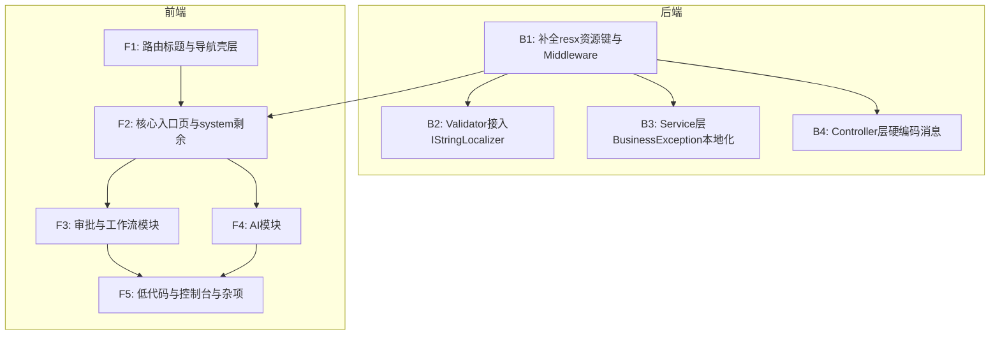

# 应用级国际化全面适配计划

## 现状摘要

### 前端现状

- **已有基础设施**：vue-i18n 9.x、`src/i18n/` 入口与 4 个语言文件、`src/locales/` 传统语言包、`LocaleSwitch.vue` 切换组件
- **已完成**：登录页、主框架壳层（菜单/面包屑/标签页）、CrudPageLayout 通用组件、12 个 system 页面（部分）
- **待改造**：约 81 个页面 + 63 个组件仍有硬编码中文未接入 i18n
- **路由**：99 处 `meta.title`，仅 14 处有 `titleKey`

### 后端现状

- **已有基础设施**：`RequestLocalizationMiddleware`、`Messages.zh-CN.resx` / `Messages.en-US.resx`（92 个资源键）
- **已完成**：ExceptionHandlingMiddleware 部分 ErrorCode 映射、401/403/429 本地化、部分 FluentValidation Validator
- **待改造**：
  - `Program.cs` 中 8 处 JWT 硬编码中文
  - 约 20+ 个 FluentValidation Validator 未使用 `IStringLocalizer`
  - 约 15+ 个 Service 层共 150+ 处 `BusinessException` 硬编码消息
  - 约 10 个 Controller 中硬编码消息

---

## 前端实施计划

### 批次 F1：路由标题与导航壳层补齐

**目标**：所有路由统一 `meta.titleKey`，消除中文 `title` 回退依赖

**涉及文件**：

- [src/frontend/Atlas.WebApp/src/router/index.ts](src/frontend/Atlas.WebApp/src/router/index.ts) -- 补齐全部 99 处路由 `titleKey`
- [src/frontend/Atlas.WebApp/src/utils/i18n-navigation.ts](src/frontend/Atlas.WebApp/src/utils/i18n-navigation.ts) -- 精简 `titleKeyByTitle` 兜底表
- [src/frontend/Atlas.WebApp/src/i18n/extra-messages.ts](src/frontend/Atlas.WebApp/src/i18n/extra-messages.ts) -- 补齐路由标题翻译键
- 布局组件：`NotFoundPage.vue`

**验收**：中英切换后，所有导航菜单、面包屑、浏览器标题均正确显示

### 批次 F2：核心入口页与 system 剩余页面

**目标**：高频访问页面全部接入 i18n

**涉及页面**（约 25 个）：

- **首页/个人中心**：`HomePage.vue`（43 处中文）、`ProfilePage.vue`（55 处）、`LicensePage.vue`（54 处）
- **system 剩余**：`AppsPage.vue`、`NotificationManagePage.vue`、`NotificationsPage.vue`、`OnlineUsersPage.vue`、`PluginManagePage.vue`、`WebhooksPage.vue`
- **apps 管理**：`AppDashboardPage.vue`、`AppDepartmentsPage.vue`、`AppPagesPage.vue`、`AppPositionsPage.vue`、`AppProjectsPage.vue`、`AppRolesPage.vue`、`AppSettingsPage.vue`、`AppUsersPage.vue`
- **通用组件**：`common/` 下 6 个未国际化的组件（EmptyState、FilterToolbar、StatusSwitch 等）

**策略**：

- 每个页面接入 `useI18n()`，将标题、列名、按钮、弹窗、校验文案、空状态提示替换为 `t('xxx')`
- 键命名规范：`<module>.<page>.<element>`（如 `home.pendingApprovals`、`profile.changePassword`）
- 翻译键统一追加到 `runtime-messages.ts`

### 批次 F3：审批/工作流模块

**目标**：审批流全链路（设计/发起/审批/管理）国际化

**涉及文件**（约 55 个）：

- **页面**（12 个）：`ApprovalFlowsPage.vue`、`ApprovalDesignerPage.vue`、`ApprovalWorkspacePage.vue`、`ApprovalTaskPoolPage.vue`、`ApprovalInstanceManagePage.vue`、`ApprovalInstanceDetailPage.vue`、`ApprovalTaskDetailPage.vue`、`ApprovalStartPage.vue`、`ApprovalFlowManagePage.vue`、`ApprovalAgentConfigPage.vue`、`ApprovalDepartmentLeaderPage.vue`、`WorkflowDesignerPage.vue`、`WorkflowInstancesPage.vue`
- **components/approval/**（43 个）：x6 节点/shapes、属性面板、运行态组件等
- **components/workflow/**（4 个）
- **workflow 页面**（2 个）：`WorkflowListPage.vue`、`WorkflowEditorPage.vue`

**策略**：

- 优先改入口页面和常用弹窗，再改设计器内部节点组件
- x6 节点的显示文案通过 i18n key 传入，保持 shape 组件的纯展示特性

### 批次 F4：AI 模块

**目标**：AI 全模块页面和组件国际化

**涉及文件**（约 39 个）：

- **pages/ai/**（25 个）：AiMarketplacePage、AiWorkspacePage、AgentListPage、AgentEditorPage、AgentChatPage、KnowledgeBaseListPage 等
- **components/ai/**（14 个）：DatabaseImportModal、GlobalSearchBar、PluginDebugPanel、ChatMessage 等

### 批次 F5：低代码/控制台/可视化/杂项

**目标**：剩余所有长尾页面国际化

**涉及文件**（约 35 个）：

- **lowcode/**（9 个）：FormDesignerPage、FormListPage、PluginMarketPage、ProcessMonitorPage 等
- **console/**（11 个）：ConsolePage、ApplicationCatalogPage、ReleaseCenterPage 等
- **visualization/**（4 个）：VisualizationCenterPage、VisualizationDesignerPage 等
- **杂项**：`dynamic/`（2 个）、`monitor/`（1 个）、`runtime/`（1 个）、`settings/`（1 个）、`admin/`（1 个）
- **designer 组件**（7 个）、**amis 组件**（2 个）、**context 组件**（1 个）
- `RegisterPage.vue`、`AlertPage.vue`、`AssetsPage.vue`

### 前端语言包管理（与各批次并行）

- 新增键统一落在 `runtime-messages.ts`（运行时页面文案），保持中英对称
- 键命名约定：`<module>.<page|component>.<element>`
- 每批次完成后，检查 zh-CN 和 en-US 键数是否一致

---

## 后端实施计划

### 批次 B1：补全 resx 资源键 + 统一 ExceptionHandlingMiddleware

**目标**：建立完整的资源键映射体系，消除所有硬编码 fallback

**涉及文件**：

- [src/backend/Atlas.Application/Resources/Messages.zh-CN.resx](src/backend/Atlas.Application/Resources/Messages.zh-CN.resx) -- 新增约 80+ 资源键
- [src/backend/Atlas.Application/Resources/Messages.en-US.resx](src/backend/Atlas.Application/Resources/Messages.en-US.resx) -- 对等新增
- [src/backend/Atlas.WebApi/Middlewares/ExceptionHandlingMiddleware.cs](src/backend/Atlas.WebApi/Middlewares/ExceptionHandlingMiddleware.cs) -- 扩展 ErrorCode 到资源键映射，消除 `"服务器内部错误"` 硬编码
- [src/backend/Atlas.WebApi/Program.cs](src/backend/Atlas.WebApi/Program.cs) -- 8 处 JWT 认证消息改为使用 `IStringLocalizer<Messages>`

**新增资源键范围**（按模块）：

- 认证/会话：`InvalidToken`、`TokenMissingTenant`、`TokenMissingUser`、`TokenMissingSession`、`UserDisabledOrNotExist`、`SessionExpired`、`RefreshTokenInvalid` 等
- MFA：`MfaAlreadyEnabled`、`MfaNotEnabled`、`MfaCodeInvalid`、`UserNotFound` 等
- 审批流：`TaskIdRequired`、`TransferUserInvalid`、`NoPermissionToMarkRead`、`DeptIdRequired` 等
- AI：`VariableNotFound`、`VariableKeyDuplicated`、`PromptNameExists`、`DatabaseNotFound` 等
- 低代码/动态表：`DynamicTableNotFound`、`TableKeyExists`、`FieldPermissionDenied` 等
- 通用：`TenantIdRequired`、`ResourceNotFound`、`IdempotencyConflict` 等

### 批次 B2：FluentValidation Validator 全面接入 IStringLocalizer

**目标**：所有 Validator 的 `.WithMessage()` 改为资源键引用

**涉及文件**（约 20 个 Validator）：

- `MigrationRecordCreateRequestValidator.cs`
- `LowCodeEnvironmentValidators.cs`（12 处）
- `ApprovalDepartmentLeaderRequestValidator.cs`
- `ApprovalTaskDecideRequestValidator.cs`
- `ApprovalOperationRequestValidator.cs`
- `ApprovalFlowDefinitionCreateRequestValidator.cs` / `UpdateRequestValidator.cs`
- `ApprovalStartRequestValidator.cs`
- `SystemConfigValidators.cs`
- `DynamicRecordQueryRequestValidator.cs` / `UpsertRequestValidator.cs`
- `PublishEventRequestValidator.cs`
- `LowCodePageValidators.cs`（18 处）
- `FormDefinitionValidators.cs`（13 处）
- `TableViewValidators.cs`（9 处）
- `ModelConfigValidators.cs`（4 处）
- `PermissionValidators.cs`
- `UserValidators.cs`
- `TenantAppMembershipValidators.cs`
- `DictValidators.cs`

**模式**：在 Validator 构造函数注入 `IStringLocalizer<Messages>`，`.WithMessage()` 改为 `.WithMessage(localizer["ResourceKey"])`

### 批次 B3：Service 层 BusinessException 本地化

**目标**：所有 `throw new BusinessException(code, message)` 中的 `message` 改用资源键

**方案选择**：为 `BusinessException` 统一约定：`message` 字段传资源键而非最终文案，由 `ExceptionHandlingMiddleware` 统一通过 `IStringLocalizer` 解析最终文案。

**涉及服务文件**（约 15 个，150+ 处）：

- `JwtAuthTokenService.cs`（16 处）
- `DynamicTableCommandService.cs`（45+ 处）
- `DynamicRecordCommandService.cs`（4 处）
- `RoleCommandService.cs`（11 处）
- `PositionCommandService.cs`（6 处）
- `ProjectCommandService.cs`（4 处）
- `TableViewCommandService.cs`（6 处）
- `AiVariableService.cs`（3 处）
- `AiPromptService.cs`（6 处）
- `AiDatabaseService.cs`（20+ 处）
- `LowCodeAppCommandService.cs`（20+ 处）
- `AiMarketplaceService.cs`（8 处）
- `FieldPermissionResolver.cs`（2 处）
- 其他：`FlowEngine`、`ComponentTemplateService`、`LicenseTenantAdminProvisionService` 等

### 批次 B4：Controller 层硬编码消息

**目标**：Controller 中直接返回的 `Fail()`/`NotFound()` 消息改用资源键

**涉及文件**（约 10 个）：

- `AuthController.cs` -- `"缺少租户标识"`
- `SessionsController.cs` -- `"会话不存在"`
- `TenantsController.cs` -- `"租户不存在"`
- `SystemConfigsController.cs` -- `"参数不存在"`
- `AiVariablesController.cs` -- `"变量不存在"`
- `ExpressionsController.cs` -- `"表达式不能为空"`
- `RuntimeTasksController.cs` -- `"taskId 无效"`
- `ApprovalTasksController.cs` -- 多处
- `MfaController.cs` -- 约 9 处
- `PermissionsController.cs` -- `"Permission not found."`

---

## 实施顺序与依赖关系

- 后端 B1 优先，为前端提供完整的本地化错误消息
- 前端 F1 可与 B1 并行
- B2/B3/B4 可并行推进
- 前端 F3/F4 可并行推进

## 验收标准

- 中英文切换后，所有页面的导航、表格列名、按钮、弹窗、表单校验、空状态提示、错误消息均可双语展示
- 后端 API 根据 `Accept-Language` 返回对应语言的错误消息和校验提示
- `npm run build` 和 `dotnet build` 均 0 错误 0 警告
- zh-CN 与 en-US 语言包键数一致，resx 资源键中英对称
- 核心流程冒烟回归（登录、导航、系统管理 CRUD、审批、AI 入口）通过

## 风险控制

- 大范围替换可能导致回归 -- 按批次提交，每批次完成后执行 lint/build 验证
- 语言包键冲突 -- 建立命名规范 `<module>.<page>.<element>`，新增键统一落在 `runtime-messages.ts`
- 后端资源键遗漏 -- 每新增一个 `BusinessException` 消息，同步在两个 resx 文件中补齐

