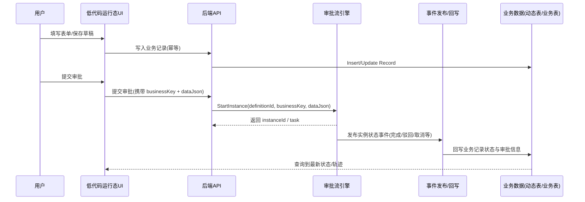
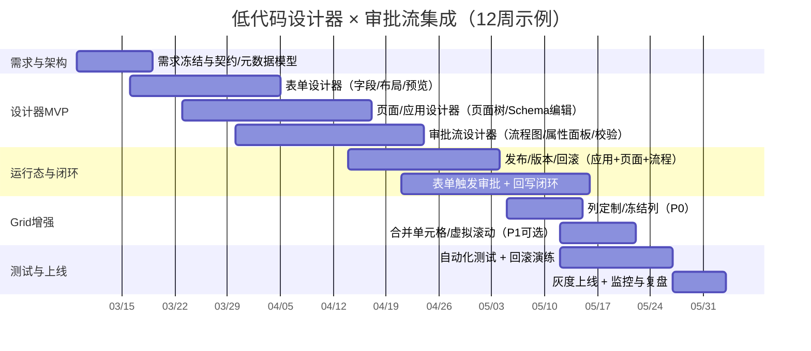

# 低代码设计器与审批流集成深度研究报告：组件开发与可闭环实施方案

## 执行摘要

本研究严格按你的要求，优先使用启用的连接器 **github**，并且仅检索指定仓库 **lKGreat/SecurityPlatform**；在覆盖仓库实现与文档之后，再补充检索主流低代码平台与流程引擎的官方/原始资料，形成“可落地、可验收、可回滚”的闭环方案。仓库侧可直接作为“参考实现/对标样例”，其内容集中体现了：低代码应用与页面的版本化发布、表单与页面设计器、审批流设计器与运行时、以及动态表记录发起审批与状态回写的闭环链路。fileciteturn11file8L1-L1 fileciteturn10file0L1-L1 fileciteturn10file1L1-L1 fileciteturn10file2L1-L1 fileciteturn86file2L1-L1 fileciteturn87file3L1-L1

从“低代码设计器 × 审批流”集成角度，仓库中最具闭环价值的链路是：  
- **设计态**：低代码应用/页面（App Builder）与表单设计器（Form Designer）支持草稿编辑、预览、发布、版本历史与回滚，并支持环境变量/环境配置。fileciteturn10file0L1-L1 fileciteturn11file8L1-L1  
- **流程态**：审批流设计器支持“基础信息 → 表单设计（低代码表单）→ 流程图设计”的三段式编辑体验，并在流程属性面板中承载条件表达式、字段权限与按钮权限等关键配置。fileciteturn10file2L1-L1 fileciteturn93file2L1-L1  
- **运行态闭环**：动态表记录可通过接口提交审批（触发实例），并依靠审批事件处理器 + 状态同步处理器实现业务模型回写（例如把记录状态从“审批中”更新为“已通过/已驳回”等），形成端到端闭环。fileciteturn86file4L1-L1 fileciteturn86file2L1-L1 fileciteturn87file0L1-L1 fileciteturn87file3L1-L1 fileciteturn88file0L1-L1

在你关注的“表达式”方面，仓库侧已经存在审批条件求值器（支持条件组与表达式子集），适合作为统一表达式服务的基础；从工程风险与安全角度，推荐将表达式体系收敛到“可静态校验、非图灵完备、宿主可控上下文”的安全表达式语言（例如 CEL 的设计理念），并为设计器提供可视化变量选择与类型提示。fileciteturn95file0L1-L1 citeturn16search4turn16search5

在“Grid 列定制（冻结列/合并单元格/高级 Grid）”方面，仓库已经有“个人表格视图（TableViews）”与前端列配置能力，覆盖常见的列显隐/排序/固定列（冻结列）等；合并单元格属于更“数据网格（Data Grid）”能力，建议以可插拔方式引入成熟网格组件（或在现有表格组件之上扩展 cell-span 能力），并在低代码元数据中抽象为可配置规则。fileciteturn11file8L1-L1 fileciteturn11file12L1-L1 citeturn16search3turn19search1turn17search1

## 需求与功能清单

以下需求清单以你的范围为准（表单/页面/列表/Grid、字段编辑、列定制、表达式、校验、预览、组件化复用、审批流集成），并参考仓库中已出现的“低代码应用/页面契约、动态表与 AMIS Schema 输出、审批流设计器契约、TableViews 列配置模型”等实现线索。fileciteturn11file8L1-L1 fileciteturn10file0L1-L1 fileciteturn10file2L1-L1 fileciteturn11file10L1-L1

| 需求域 | 细粒度能力（字段/组件/表达式/权限/预览/校验） | P0/P1 建议 |
|---|---|---|
| 表单设计器 | 字段级编辑：数据类型、默认值、必填、正则、长度、枚举/字典、联动（依赖其他字段）、只读/隐藏；布局：分组/栅格/标签位置/自适应；运行态：只读渲染、禁用态渲染、提交态校验与错误定位；“保存草稿/发布/版本/回滚” | P0：字段+布局+预览+发布；P1：联动/复杂校验/版本差异对比 |
| 页面设计器（Page/App Builder） | 页面树管理（父子、排序、路由路径、图标）；页面类型（List/Form/Detail/Dashboard/Blank）；Schema 级编辑（JSON/可视化混合）；环境变量替换（dev/test/prod）；发布与回滚（应用级与页面级版本） | P0：页面树+发布回滚；P1：多环境变量与灰度 |
| 列表/Grid 设计器 | 列显隐、顺序、宽度、对齐、溢出省略、排序/过滤、密度；冻结列（左/右）；合并单元格（rowSpan/colSpan 或 mergeCells 规则）；高级用法：分组表头、汇总、虚拟滚动、行/列固定、行分组、单元格编辑 | P0：列定制+冻结列；P1：合并+高级网格（虚拟滚动/编辑/汇总） |
| 表达式体系 | 变量分层：全局参数（系统配置）、租户级、应用级、环境级、页面级（局部变量）、组件/字段局部变量、运行时上下文（登录用户/组织/角色/项目/请求参数/记录上下文）；表达式用途：字段可见性、默认值、校验规则、审批条件、路由条件、按钮可用性 | P0：上下文分层+条件表达式；P1：字段公式/依赖追踪/静态类型检查 |
| 表达式输入体验 | 可视化变量选择器（变量树 + 搜索）；函数提示（日期、字符串、集合、数值）；类型提示与错误定位；静态校验（括号/非法 token/危险函数）；表达式“试运行”与快照数据（模拟上下文） | P0：变量选择+基础校验；P1：类型系统+可视化调试 |
| 权限与审计 | 最小要求：RBAC；增强：字段级权限（读/写/隐藏）、按钮权限、数据范围（本人/部门/全部/项目维度）；审计事件：设计态（发布/回滚/变更）、运行态（提交审批/审批决策/回写/导出/打印/预览） | P0：RBAC+审计；P1：字段级/数据范围+证据导出 |
| 表单触发审批流 | 从业务表单（动态表/低代码表单）发起实例：携带 businessKey、dataJson（表单数据快照/摘要/主键引用）；支持“草稿保存 → 提交审批”；幂等提交与防重复发起 | P0：发起+幂等；P1：草稿协作、多次提交策略 |
| 流程回写 | 实例/任务状态回写到业务记录（审批中/已通过/已驳回/已取消）；回写范围：状态字段、审批人/时间戳、审批意见摘要、附件/签名；失败重试与死信处理 | P0：状态回写；P1：回写扩展点+重试队列 |
| 审批节点表单嵌入 | 按节点嵌入表单（同一表单在不同节点只读/可写/隐藏不同字段）；节点表单的“字段权限映射”和“按钮权限映射”；节点操作对表单数据的变更策略（仅意见、或允许补充字段） | P0：字段 R/W/H；P1：节点级数据补充与合并策略 |
| 组件化开发与复用 | 组件注册表（组件元数据、属性面板 schema、运行态 renderer）；版本与兼容（semver、弃用策略）；可复用模板（页面模板/表单模板/流程模板）；插件机制（新增字段类型/校验器/数据源连接器/流程节点） | P0：模板+组件库；P1：插件生态与市场化 |

## 系统架构设计

本节给出“设计态—运行态—事件闭环”的架构蓝图（可直接落到你的系统实现），同时用仓库的契约与模块拆分作为可行性参考：它已定义统一请求头、幂等键与 CSRF、低代码应用/页面发布回滚、审批流定义/实例/任务接口、以及 TableViews 列配置与固定列等。fileciteturn11file8L1-L1 fileciteturn82file3L1-L1

```mermaid
flowchart LR
  subgraph DT[设计态 Design-time]
    DT1[表单设计器<br/>字段/布局/校验] --> DT5[表单定义(FormDef)\n草稿/发布/版本]
    DT2[页面/应用设计器<br/>页面树/Schema编辑/环境变量] --> DT6[页面定义(PageDef)\n草稿/发布/版本]
    DT3[Grid设计器<br/>列定制/冻结/合并规则] --> DT7[视图定义(TableViewDef)\n个人/共享]
    DT4[审批流设计器<br/>节点/条件/权限/表单嵌入] --> DT8[流程定义(FlowDef)\n草稿/发布/版本]
  end

  subgraph RT[运行态 Run-time]
    RT1[运行时渲染器<br/>Page/Form Renderer] --> RT2[数据访问层<br/>动态表/外部数据源]
    RT1 --> RT3[表达式服务<br/>校验/编译/求值]
    RT1 --> RT4[审批流运行时<br/>实例/任务/操作]
    RT4 --> RT5[域事件发布器<br/>in-proc 或 MQ]
    RT5 --> RT6[业务回写处理器<br/>回写状态/字段]
  end

  subgraph GOV[治理与运维]
    GOV1[权限中心<br/>RBAC/数据范围/字段权限]
    GOV2[审计与证据链<br/>操作留痕/导出]
    GOV3[发布与回滚<br/>元数据版本/迁移]
  end

  DT --> RT
  GOV1 --> RT
  RT --> GOV2
  DT --> GOV3
```

上图在仓库中的“可落地证据点”包括：  
- 低代码应用与页面的发布、版本历史与回滚契约，以及运行态 Schema（支持草稿/已发布模式与环境变量替换）。fileciteturn11file8L1-L1  
- 审批流定义/实例/任务的接口集合与状态模型，且包含“发布/停用/版本对比/导入导出”等治理能力。fileciteturn11file8L1-L1  
- 动态表记录审批闭环：记录侧提交审批端点、命令服务 SubmitApprovalAsync、以及审批事件处理器回写状态。fileciteturn86file4L1-L1 fileciteturn86file2L1-L1 fileciteturn87file3L1-L1  
- 表格视图 TableViews 与 pinned（固定列）等列定制配置（冻结列能力）。fileciteturn11file8L1-L1 fileciteturn11file12L1-L1

运行态“表单提交 → 触发审批 → 回写”的推荐数据流如下（可直接作为你系统的“闭环验收用例”）：



接口契约层建议统一以下三类“公共约束”，仓库也已给出成熟范式：  
- **上下文头**：租户（X-Tenant-Id）、应用（X-App-Id 或从 JWT claim 获取）、项目域（X-Project-Id）、客户端信息等。fileciteturn11file8L1-L1  
- **写接口幂等**：Idempotency-Key，避免重复提交与重复发起审批。fileciteturn11file8L1-L1  
- **Web 写请求 CSRF 防护**：X-CSRF-TOKEN（若采用 Cookie/浏览器会话）。fileciteturn11file8L1-L1

技术栈方面：你的项目技术栈 **未指定**；仓库给出一种可参考的“前后端 + 低代码 + 安全基线”组合（.NET 10 + Vue 3 + Ant Design Vue + AMIS），并明确了统一响应、幂等、CSRF 与 RBAC 等工程规范。fileciteturn82file3L1-L1  
若需要“推荐 3 套可选方案”，建议如下（可按你的团队能力与合规要求选型）：

| 方案 | 设计器技术 | Grid 技术 | 表达式技术 | 流程/审批技术 | 优点 | 主要风险 |
|---|---|---|---|---|---|---|
| A（参考仓库路径） | Vue3 + Schema 编辑器（JSON/可视化混合） | 现有表格 + TableViews；高级网格可插件化 | 统一表达式服务 + 变量分层 | 内建审批流 +（可选）内嵌工作流引擎 | 与现有工程规范/安全基线一致，闭环容易做；发布/回滚可围绕元数据版本展开 | 需要自己完成组件生态与高级网格能力；表达式与模板治理要做好 fileciteturn11file8L1-L1 |
| B（生态组件优先） | Alibaba LowCode Engine（插件化内核） | VXE-Table 或 AG Grid | CEL（或 CEL 风格子集） | 选内建审批或外置 BPMN 引擎 | LowCode Engine 强调“最小内核+插件/物料生态+工具链”，更适合做组件市场与可扩展设计器 citeturn22search6turn22search4 | 引擎接入与团队学习成本；需要把运行态、权限、审计与发布体系自己补齐 |
| C（SaaS/平台集成优先） | 商业低代码平台设计器 | 平台内置 Table/Grid | 平台内置公式/脚本 | 平台内置审批或对接工作流产品 | 上手快；例如 Power Automate 的 approvals 支持多种审批类型与顺序审批 citeturn0search0turn0search2 | 可控性与二次开发边界；企业审计/权限/私有化与“闭环回写”需要额外方案设计 |

## 审批流集成模式对比

你要求至少三种模式（同步触发 / 异步消息 / 流程引擎嵌入）。下面给出可复制的对比表，并结合仓库“已实现闭环”的方式给出落地建议：仓库本身同时体现了“同步触发 + 引擎内嵌 + 事件回写”的组合。fileciteturn86file4L1-L1 fileciteturn87file1L1-L1 fileciteturn87file3L1-L1

| 模式 | 触发与返回 | 回写方式 | 一致性与可靠性 | 适用场景 | 与主流引擎/实践对齐证据 |
|---|---|---|---|---|---|
| 同步触发（REST） | 表单提交后直接调用审批引擎 StartInstance，立即返回 instanceId/task | 同进程回写或后续轮询 | 实现简单；但需要处理超时、重试与幂等（尤其“提交审批”） | 业务系统与审批引擎同域、延迟要求不高、希望快速闭环 | Camunda REST 启动流程实例支持 businessKey 与 variables citeturn20search0；Activiti 也强调 businessKey 的业务意义与最佳实践 citeturn20search6turn20search3 |
| 异步消息（事件驱动） | 表单仅投递“发起审批事件”到 MQ/事件总线；消费者异步启动流程 | 通过事件回调/订阅回写业务状态 | 最稳健：可做重试/死信/补偿；但系统复杂度更高（需要 MQ、对账与可观测） | 跨系统审批、峰值高、需要隔离审批引擎故障 | Workflow Core 提供外部事件发布/等待机制，可作为事件驱动的一种实现思路 citeturn21search1turn21search11 |
| 流程引擎嵌入（Library/Embedded） | 引擎作为库嵌入业务服务，StartInstance 为本地方法调用 | 引擎内部状态变化触发域事件（in-proc），回写由处理器执行 | 性能好、运维简单；但需要治理“升级兼容/多节点持久化/队列调度” | 你要强一致、强控制、且审批是平台核心能力 | Workflow Core 明确定位为可嵌入工作流引擎，并支持持久化提供者 citeturn21search9turn21search2；仓库通过事件处理器接口实现业务回写也符合此思路 fileciteturn87file0L1-L1 |

选型建议（面向“低代码设计器 × 审批闭环”）：  
- 若你希望最快落地且系统在同一平台内，建议优先 **“同步触发 + 引擎嵌入 + 事件回写”**：表单提交审批同步返回实例信息，回写由内部事件处理器异步化/解耦化执行，既保留低耦合扩展点，又能保持运维简化。仓库已经提供了相对标准的扩展点：业务模块实现 IApprovalEventHandler 接口接收流程事件，并由发布器统一派发。fileciteturn87file0L1-L1 fileciteturn87file1L1-L1  
- 若你必须跨系统（多个业务域、多语言栈）且审计与追踪要求更高，建议升级为 **异步消息模式**，并将“提交审批→启动实例→回写状态”拆成可追踪的 Saga/补偿流程。

## 详细实施计划与交付

本实施计划强调“可闭环”：每一阶段都必须同时产出 **设计态能力 + 运行态能力 + 回写与审计 + 测试与回滚方案**。仓库中已经存在低代码路线图与审批流 v1/v2 实施计划文档，可作为任务拆解的参考输入。fileciteturn98file0L1-L1 fileciteturn95file2L1-L1

里程碑与任务分解（建议以 12 周为一个可交付周期；日期可按你项目实际起始日平移）：

| 里程碑 | 关键产出 | 任务分解（摘要） | 角色配置 | 估时（人日） |
|---|---|---|---|---|
| 需求冻结与架构定稿 | 需求清单、元数据模型、接口契约、风险清单 | 统一变量分层模型；统一表达式接口；审批回写策略；Grid 能力范围（冻结/合并/虚拟滚动） | 产品1、架构1、后端1、前端1 | 10–15 |
| 设计器 MVP | 表单/页面/流程设计器可用 + 预览 | 表单字段/布局/校验；页面树与 schema 编辑；流程图、节点属性面板、条件配置 | 前端2–3、后端1 | 35–50 |
| 运行时与发布回滚闭环 | 草稿/发布/版本/回滚可用 | 元数据版本化；运行态 schema 获取；发布审计；回滚策略（元数据回滚优先） | 后端2、前端1、测试1 | 25–40 |
| 提交审批与回写闭环 | “表单触发流程→审批→回写”端到端 | 提交审批幂等；实例/任务接口；事件发布与业务回写处理器；失败重试与补偿 | 后端2–3、测试1 | 30–45 |
| Grid 高级能力 | 冻结列（P0）+ 合并单元格（P1 可选） | 列配置模型扩展（pinned/mergeRule）；设计器 UI；运行态渲染适配 | 前端1–2 | 15–30 |
| 测试、上线与回滚演练 | 自动化测试集、灰度与回滚预案 | E2E 用例；性能与安全基线测试；上线脚本；回滚演练（元数据+数据库变更） | 测试1–2、运维1、后端1 | 20–30 |

时间线（示例，可复制修改）：



测试计划（建议作为验收材料的一部分交付）：  
- **单元测试**：表达式解析/校验、条件求值、字段校验器、回写处理器（对不同实例状态的回写逻辑）。表达式语言推荐参考 CEL 的“安全、可控上下文、非图灵完备”的设计理念，并在设计态做静态校验。citeturn16search4turn16search5  
- **集成测试**：提交审批接口幂等；实例/任务操作链路；回写一致性；并行/条件节点覆盖。仓库审批流契约已把“定义校验 details（含 nodeId 定位）”作为工程化方向，可沿此思路做自动化断言。fileciteturn11file8L1-L1  
- **端到端（E2E）**：至少覆盖 5 条闭环用例：  
  1) 设计表单 → 预览 → 发布 → 运行态可用；  
  2) 设计流程并发布 → 可发起实例；  
  3) 运行态提交审批 → 待办出现 → 审批 → 回写业务状态；  
  4) 字段权限在不同节点生效；  
  5) 回滚到上一版本后运行态恢复。低代码应用/页面“版本历史与回滚”契约在仓库中已有清晰定义，可作为验收口径基线。fileciteturn11file8L1-L1  
- **上线回滚策略**：  
  - 元数据变更（页面/表单/流程）优先走“版本化发布 + 快速回滚”；  
  - 数据结构变更（动态表 Alter/迁移）必须具备迁移记录与回退预案（可先采用“备份恢复”策略，后续再完善可逆迁移）；  
  - 审批回写处理器应具备“失败不阻断主流程、可重试、可观测”的特性，仓库中已有“事件发布器 + 多处理器”的扩展点形式，可沿用并加强重试与告警。fileciteturn87file1L1-L1 fileciteturn88file0L1-L1

可交付物清单（建议作为项目验收附件）：  
- 需求与设计：需求清单、元数据模型、接口契约（OpenAPI/契约文档）、表达式语法规范与变量字典、权限矩阵、回写策略说明。仓库 contracts.md 已体现“统一请求头、幂等、低代码/审批/表格视图”契约组织方式，可直接对齐为交付模板。fileciteturn11file8L1-L1  
- 代码与组件：设计器组件库（表单/页面/Grid/审批流）、运行态渲染器、表达式服务、审批回写处理器、审计埋点。  
- 测试与运维：自动化测试报告、E2E 脚本、性能结果、上线手册、回滚演练记录。  
- 合规与审计：审计事件字典、关键操作日志留存策略、SSO 兼容说明（OIDC/SAML）、权限审计报表导出。

验收标准（可量化口径）：  
1) 表单/页面/Grid：从设计态发布到运行态无人工改代码；发布与回滚均可在 5 分钟内完成（元数据级）。fileciteturn11file8L1-L1  
2) 审批闭环：对同一业务记录，完成“提交审批→审批通过→业务状态回写→审计可追溯”。仓库已存在“动态表记录提交审批端点 + SubmitApprovalAsync + 回写处理器”的闭环结构，可按此实现验收用例。fileciteturn86file4L1-L1 fileciteturn86file2L1-L1 fileciteturn87file3L1-L1  
3) 表达式：表达式编辑器要支持变量选择、静态校验、试运行；审批条件与页面/字段条件使用同一表达式引擎（或至少同一语法子集）。安全表达式的设计目标可参考 CEL 的定位。citeturn16search4turn16search5  
4) 权限与审计：关键写接口幂等、Web 写接口 CSRF、防越权（字段级/数据范围），审计事件可检索导出。仓库的统一头、幂等与 CSRF 契约可以作为验收基线。fileciteturn11file8L1-L1

示例实现片段与伪代码（便于你快速对齐实现思路）：

```json
// 表单定义（FormDef）示例：字段+布局+校验+权限（简化）
{
  "formKey": "purchase_request",
  "version": 3,
  "fields": [
    { "key": "title", "type": "string", "required": true, "maxLength": 80 },
    { "key": "amount", "type": "decimal", "required": true, "min": 0 },
    { "key": "reason", "type": "text", "required": true, "maxLength": 2000 }
  ],
  "layout": {
    "type": "grid",
    "columns": 2,
    "items": [
      { "field": "title", "colSpan": 2 },
      { "field": "amount", "colSpan": 1 },
      { "field": "reason", "colSpan": 2 }
    ]
  },
  "permissions": {
    "field": {
      "title": { "read": ["Requester", "Approver"], "write": ["Requester"], "hide": [] },
      "amount": { "read": ["Requester", "Approver"], "write": ["Requester"], "hide": [] },
      "reason": { "read": ["Requester", "Approver"], "write": ["Requester"], "hide": [] }
    }
  }
}
```

```ts
// 表达式解析/校验/求值伪代码：强调“上下文分层 + 静态校验 + 运行时沙箱”
type VarScope = {
  global: Record<string, unknown>;     // 系统参数
  tenant: Record<string, unknown>;     // 租户参数
  app: Record<string, unknown>;        // 应用参数
  page: Record<string, unknown>;       // 页面局部
  user: { id: string; roles: string[]; deptId?: string };
  record?: Record<string, unknown>;    // 行/记录上下文
};

function validateExpression(expr: string): { ok: boolean; errors: string[] } {
  // 1) 词法/括号/长度等基础校验
  // 2) 禁止危险函数/黑名单 token（如 eval / new Function / 反射式访问）
  // 3) 可选：类型推断（amount 是 number 则 amount > 100 合法）
  return { ok: true, errors: [] };
}

function evalExpression(expr: string, scope: VarScope): boolean | string | number {
  // 推荐：使用可控表达式语言（CEL 或其子集），只暴露 scope 映射，不允许任意对象逃逸
  const ctx = {
    global: scope.global,
    tenant: scope.tenant,
    app: scope.app,
    page: scope.page,
    user: scope.user,
    record: scope.record ?? {}
  };
  return SafeExpressionEngine.evaluate(expr, ctx);
}
```

```ts
// Grid 冻结列 + 合并单元格：用“配置模型”抽象，运行态适配不同表格引擎
type ColumnDef = {
  key: string;
  title: string;
  width?: number;
  pinned?: "left" | "right"; // 冻结列
};

type MergeRule = { row: number; col: number; rowspan: number; colspan: number };

type GridViewDef = {
  columns: ColumnDef[];
  mergeCells?: MergeRule[]; // 合并单元格规则（可选）
};

// 运行态适配：
// - 若使用 Ant Design Table：pinned -> column.fixed；mergeCells -> render 返回 rowSpan/colSpan
// - 若使用 VXE-Table：mergeCells 直接映射到 vxe-grid 的 mergeCells
// - 若使用 AG Grid：pinned 直接映射；合并可用 column spanning 或 custom renderer
```

上面 Grid 思路与业界组件能力对齐：  
- Ant Design Table 支持 colSpan/rowSpan 与 fixed columns（冻结列）。citeturn16search3  
- AG Grid 支持 pinned columns（以及运行时 API 调整固定）。citeturn17search1  
- VXE-Table 在仓库与官方说明中明确包含固定列与合并单元格等能力点，且社区文章给出 mergeCells 配置方式。citeturn19search1turn19search0

## 安全、权限与审计要求

你要求默认包含“企业级审计与单点登录兼容性”。在仓库参考实现中，安全与治理已经被“契约化”：统一请求头（租户/应用/项目域）、幂等键、CSRF Token、统一响应模型、以及角色/权限/数据范围等参数都形成了明确规范，可直接作为低代码与审批集成的安全底座。fileciteturn11file8L1-L1 fileciteturn82file3L1-L1

建议在你自己的系统中，把安全与审计要求前置为“设计器配置也必须遵守的约束”，避免运行态出现“低代码注入/越权/审计缺失”的高风险问题：  
- **SSO 兼容**：建议统一到 OIDC（或兼容 SAML2 的企业 IdP），并把登录态信息注入表达式上下文（user/roles/dept/project），用于字段可见性与审批策略。  
- **字段级与按钮级权限**：审批节点嵌入表单时，必须按节点配置输出字段权限（R/W/H），并将“节点操作按钮（同意/驳回/退回等）”同样纳入权限模型；仓库 contracts 中已经把 formPermissionConfig 和 buttonPermissionConfig 明确列为流程定义结构的一部分，可作为你的数据模型参考。fileciteturn11file8L1-L1  
- **幂等与防重放**：对“提交审批”“同意/驳回”等高价值操作，必须强制 Idempotency-Key，并对 payload 冲突给出明确错误；仓库契约已给出唯一键组成与冲突语义。fileciteturn11file8L1-L1  
- **审计事件闭环**：至少覆盖：发布/回滚、提交审批、审批决策、运行时操作、预览/打印、回写结果。仓库的审批流功能说明也强调这些行为应记录审计日志。fileciteturn83file0L1-L1  
- **表达式安全**：表达式必须“静态可校验 + 运行时只访问宿主提供数据”。CEL 的公开说明强调其“安全、非图灵完备、仅能访问宿主提供数据”的原则，非常适合作为企业级规则表达式的范式参考。citeturn16search4turn16search5  
- **低代码模板/脚本治理**：若使用 AMIS 生态的表达式/模板能力，可参考其配套解析库（amis-formula）来理解表达式/模板解析边界，并在平台侧增加“白名单函数 + 禁止任意脚本执行”的治理策略。citeturn16search7

## 风险与缓解措施、成本与资源估算

主要风险与缓解（尽量用“可执行动作”表达）：

| 风险 | 表现 | 影响 | 缓解措施（可操作） |
|---|---|---|---|
| 表达式体系失控 | 设计器里出现多套语法（页面一套、流程一套、校验一套） | 维护成本与安全风险急剧上升 | 建立统一 Expression Service：语法统一、变量分层统一、静态检查统一；优先采用 CEL 风格安全表达式并禁用任意脚本 citeturn16search4turn16search5 |
| Grid 高级能力“拖垮设计器” | 合并/虚拟滚动/编辑/汇总需求不断叠加 | 交付延期、性能问题 | 先做 P0（列定制+冻结列），P1 再引入成熟网格能力；以配置模型抽象适配层（Renderer Adapter），避免绑定单一实现 citeturn16search3turn17search1turn19search1 |
| 审批回写不一致 | 流程结束但业务表状态未回写，或回写失败无追踪 | “闭环不可验收”“数据对不上账” | 回写处理器必须具备：失败重试、幂等更新、死信告警；事件处理器作为扩展点（类似 IApprovalEventHandler）并统一发布器派发 fileciteturn87file0L1-L1 fileciteturn87file1L1-L1 |
| 版本与兼容性问题 | 元数据发布后旧实例/旧页面无法运行 | 线上事故、回滚困难 | 元数据版本化：实例绑定版本快照；运行态渲染按“实例版本→页面版本→组件版本”解析；提供一键回滚（元数据优先） fileciteturn11file8L1-L1 |
| 企业级审计不完整 | 关键行为未留痕或无法导出 | 合规与内控失败 | 审计事件字典先行；关键操作统一埋点；导出链路纳入验收（审批历史/变更历史/发布回滚历史） fileciteturn83file0L1-L1 |

成本/资源估算（按“低/中/高”三档假设；你的实际预算与团队熟练度未指定，以下为常见区间）：

| 档位 | 目标范围 | 团队配置（建议） | 周期 | 典型交付 |
|---|---|---|---|---|
| 低 | 单业务线、单租户/少租户、P0 能力闭环 | 前端2、后端2、测试1、产品0.5、运维0.5 | 8–12 周 | 表单/页面/流程设计器 MVP；提交审批与状态回写闭环；列定制+冻结列；基础审计与回滚 fileciteturn98file0L1-L1 |
| 中 | 多业务线、多租户、P1 部分能力（合并单元格/更强表达式） | 前端3、后端3–4、测试2、产品1、运维1 | 4–6 个月 | 表达式类型提示与调试；网格合并/编辑部分；异步回写重试与告警；更完整发布治理 |
| 高 | 平台化生态（插件市场）、跨系统集成、异步消息模式 | 前端4–6、后端5–8、测试3、产品1–2、运维2 | 6–12 个月 | 插件化组件与数据源连接器；消息总线驱动审批；证据链自动化导出；高可用与全量可观测 |

外部平台对标提示（用于你在评审会上解释“为什么这样设计”）：  
- Power Automate approvals 提供“全部通过/任一通过/自定义响应/顺序审批”等审批类型，说明审批能力需要可配置的“签核策略”与治理能力。citeturn0search0turn0search2  
- OutSystems 的审批组件强调“把审批模块嵌入任何应用，并在结束时抛出 Approved/Rejected 事件”，这与“节点表单嵌入 + 事件回写”的闭环思想一致。citeturn22search1  
- Retool 强调预置组件与自定义组件扩展、以及可视化 workflows（API/webhook/cron 触发、可观测与权限），体现了“组件生态 + 流程编排 + 企业治理”在低代码产品中的共性需求。citeturn17search0turn22search0turn17search5  
- Tencent 微搭产品介绍明确提到工作流、消息推送、用户权限等能力，说明“低代码 + 流程 + 权限治理”是企业级平台普遍诉求。citeturn22search8  
- Alibaba LowCode Engine 强调“最小内核、物料体系、设置器、插件及全链路工具链”，适合作为“组件开发与复用”方向的开源参考。citeturn22search6turn22search4turn22search5