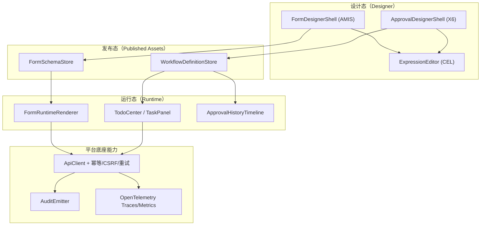
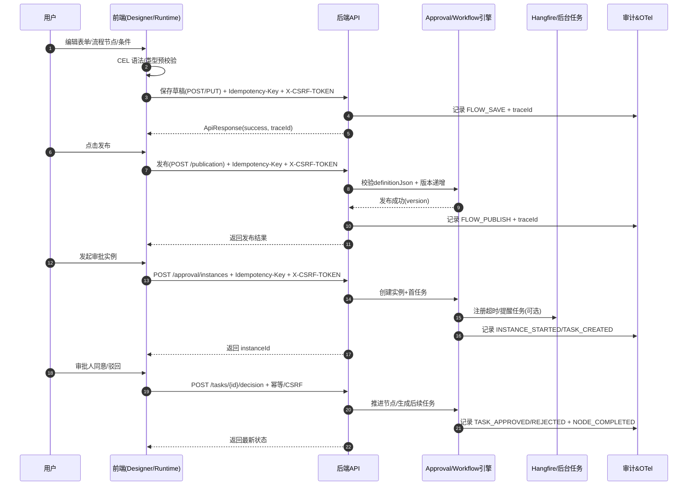
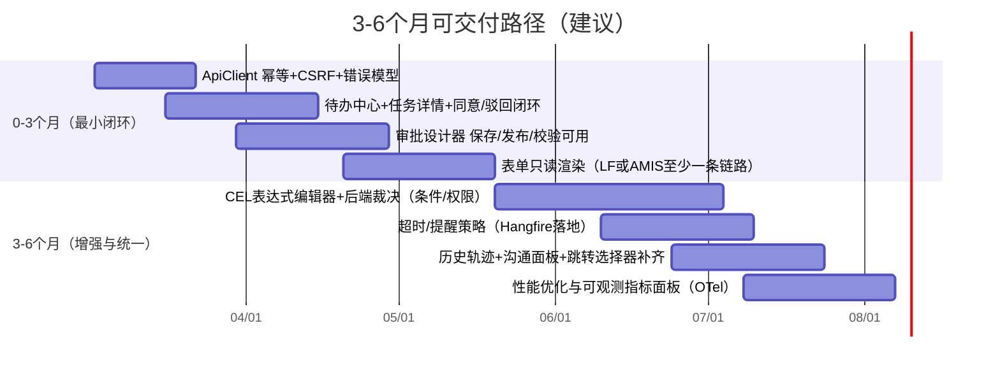

# SecurityPlatform 等保2.0 平台低代码能力研究：审批流与低代码表单的组件级设计与可交付拆解

## 执行摘要

我当前启用的连接器只有 **entity["company","GitHub","code hosting platform"]**（github），并且**仅审阅**了我指定的仓库 **lKGreat/SecurityPlatform**（未使用其他 GitHub 仓库）。在完成仓库覆盖后，我补充检索并引用了高质量公开资料（优先官方/原始文档与中文资料），尤其是 AMIS、AntV X6、Workflow Core、Hangfire、OpenTelemetry、OWASP 与等保 2.0 相关标准。citeturn4search1turn0search0turn1search0turn0search1turn1search2turn2search5turn10search7

我必须优先学习并明确的关键信息需求（3–6 项）如下（这是后续组件设计、接口契约、交付拆分能否落地的“前置真相”）：

1. **等保目标等级与取证范围**：目标等级（未指定）与测评范围（平台本身/平台承载应用/数据资源），以及必须落地到“证据链”的控制点清单（建议以 GB/T 22239-2019 为基准，并结合三级常见条款映射）。citeturn10search7  
2. **表单 Schema 统一策略**：仓库同时存在 **AMIS Schema 表单设计器**与**vform3（LF）表单**两套模型；我需要决定“统一到 AMIS 还是保持双模型并做映射/转换”，否则表达式、权限、校验、数据持久化会碎片化。citeturn4search1  
3. **审批/工作流引擎能力边界与扩展点**：审批流运行态（任务、实例、操作、通知、回调、超时）与 Workflow Core/Hangfire 的职责分层，以及“哪些逻辑必须在后端裁决”以满足安全与一致性。citeturn1search0turn0search1  
4. **多租户/多应用/多项目上下文模型**：请求头与 Claim 的权威来源、项目模式开关、跨租户隔离、数据权限与审计的最小闭环。  
5. **性能与容量目标**：并发、P95/P99、流程吞吐、设计器最大节点数/字段数、审计与追踪开销（均未指定；我在报告中给出建议范围与默认值）。  
6. **表达式语言与安全沙箱**：表达式必须同时覆盖“UI 显示/联动/校验/计算”与“审批条件/路由/超时策略”，并可在前后端一致执行；这决定了组件可复用程度与安全风险。

仓库关键发现（我在报告开头按你要求给出“文件路径 + 类/方法/配置点”证据定位；若缺失则标注“未找到/受限”）：

- **审批流设计器（前端）已具备较完整雏形**：页面编排、节点属性、条件组编辑、X6 画布、预览与树/图转换等都已存在：  
  - `src/frontend/Atlas.WebApp/src/pages/ApprovalDesignerPage.vue`（三步：基础信息/表单/L6流程设计；保存/发布/校验；调用 approval API）  
  - `src/frontend/Atlas.WebApp/src/components/approval/x6/X6ApprovalDesigner.vue`（X6 交互、右键菜单、快捷键、复制粘贴、导出 JSON、缩放）  
  - `src/frontend/Atlas.WebApp/src/components/approval/ApprovalPropertiesPanel.vue`（审批/抄送/分支/路由/子流程/定时器/触发器等属性面板）  
  - `src/frontend/Atlas.WebApp/src/components/approval/ConditionGroupEditor.vue`（OR 条件组、字段/运算符/值编辑）  
  - `src/frontend/Atlas.WebApp/src/utils/approval-tree-converter.ts`（树 ↔ definitionJson/graph 的转换；含 meta/lfForm/nodes.rootNode）  
  - `src/frontend/Atlas.WebApp/src/utils/approval-tree-validator.ts`（设计器校验：分支数量、默认分支、并行聚合、路由目标等）
- **低代码表单存在“两套体系”并行**：  
  - AMIS 表单设计：`src/frontend/Atlas.WebApp/src/pages/lowcode/FormDesignerPage.vue`（`AmisEditor`、发布/版本、PC/移动预览、导入导出）  
  - 审批“LF（vform3）表单”设计：`src/frontend/Atlas.WebApp/src/components/approval/LfFormDesigner.vue`（vform3-builds 动态加载、JSON 导入导出、字段提取用于条件/权限）
- **后端安全与生产化底座较完整**（能支撑等保条款映射与生产要件）：  
  - 幂等：`src/backend/Atlas.WebApi/Filters/IdempotencyFilter.cs`（写接口要求 `Idempotency-Key`；基于 tenant+user+apiName+key 去重；缓存响应；冲突/处理中返回 409）  
  - CSRF：`src/backend/Atlas.WebApi/Middlewares/AntiforgeryValidationMiddleware.cs` + `Program.cs`（`X-CSRF-TOKEN`；已登录写请求校验）  
  - 输入净化/XSS：`src/backend/Atlas.WebApi/Middlewares/XssProtectionMiddleware.cs`（白名单、Query 与 JSON Body 字符串净化；文档明确映射到等保输入验证控制点）  
  - 可观测性：`src/backend/Atlas.WebApi/Program.cs`（OpenTelemetry Trace/Metrics；OTLP exporter 由环境变量驱动）citeturn1search2  
  - 定时任务：`src/backend/Atlas.WebApi/Program.cs`（Hangfire）citeturn0search1turn0search4  
  - 工作流引擎：`src/backend/Atlas.WebApi/Program.cs`（Workflow Core + DSL）citeturn1search0turn1search1  
  - 合规证据映射：`docs/compliance-evidence-map.md`、生产加固：`docs/prd-case-12-production-hardening.md`
- **审批运行态 UI 仍不完整**：  
  - `src/frontend/Atlas.WebApp/src/pages/ApprovalTaskDetailPage.vue` 引用 `CommunicationPanel.vue` 与 `JumpNodeSelector.vue`，但我在仓库检索中**未找到对应文件**（标注：未找到/未能直接读取），说明运行态组件存在待补齐/未提交的缺口。

未指定关键参数（按你要求显式标注并给出建议默认范围，用于后续 PRD/验收）：

- 目标等保等级：**未指定**。仓库存在“等保三级控制点证据映射”文档，暗示默认目标可能是三级；我建议将平台底座按**三级**设计（更稳妥），承载应用可按二级/三级分级。citeturn10search7  
- 峰值并发（API QPS / 同时在线）：**未指定**。建议默认：API 峰值 200–1000 RPS（按租户隔离后可更低），在线用户 500–5000；审批待办列表 P95 < 300ms（读），提交/决策 P95 < 800ms（写），重负载下 P99 < 2s（以服务拆分与缓存兜底）。  
- 设计器规模：**未指定**。建议：单流程节点数 200（软限制）/500（硬限制），字段数 300（软）/1000（硬），并以分段渲染与布局缓存保证交互。  
- 预算与人力：**未指定**。我在路线图中按“3–6 个月最小可交付集”给出人日估算与拆分建议。

## 仓库现状与落地约束分析

我将“审批流 + 低代码表单”视为同一个生产级多应用系统中的两条主链路：**设计态（Designer）→ 发布态（Published）→ 运行态（Runtime）→ 审计与可观测（Audit/Observability）**。仓库已经把几条关键“底座约束”写得很清楚，这决定了我后续组件级设计必须遵守的硬边界：

- **接口契约与上下文头**：仓库文档给出了多租户/应用/客户端/项目的标准头，以及幂等与 CSRF 的强制要求（例如 `Idempotency-Key`、`X-CSRF-TOKEN`、`X-Tenant-Id`、`X-Project-Id` 等）。这是我设计前端 fetcher/SDK、以及每个组件“权限与审计点”的直接依据。  
- **审批定义 JSON 已形成稳定“meta + lfForm + nodes”的结构**：这意味着前端设计器不是随便画图，而必须能**可逆地**序列化/反序列化，并在后端执行时不丢语义（尤其是条件组、并行聚合、路由节点、超时策略、通知配置等）。  
- **安全中间件“默认开启”**：XSS 净化、CSRF 校验、幂等过滤器写死在全局管线/过滤器中；只要是写操作，我就必须把“幂等键生成策略、token 获取/刷新策略、重试策略”当作组件级公共能力，而不是业务页面临时补丁。  
- **工作流/定时任务/可观测已入栈**：因此审批的超时、提醒、回调、归档等“运维类能力”可以落在 Hangfire（任务调度）+ Workflow Core（长流程编排）+ OpenTelemetry（追踪/指标）之上，避免前端堆逻辑。citeturn0search1turn1search0turn1search2  
- **表单体系割裂是当前最大架构风险**：AMIS 表单设计器已经是“可视化编辑 + 发布 + 预览 + Schema 导入导出”完整链路；但审批里的 LF(vform3) 方案也在推进。若不做统一策略，很容易出现：字段权限/表达式/校验/数据持久化/报表能力全部“双实现”。citeturn4search1  

在此约束下，我给出的方案一律遵守两条可落地原则：

- **先补齐运行态最小闭环**（待办中心→任务详情→表单渲染→同意/驳回→历史轨迹/审计可查），再做编辑器“更漂亮”。  
- **把“表达式、权限、审计、幂等、CSRF、错误模型”沉到组件与 SDK 层**，业务页面只做编排。

## 表达式语言能力定义

### 我们为什么需要“统一表达式语言”

仓库里已经出现三类表达式需求：

- **页面/表单层**：字段联动、可见性、必填、计算字段、校验提示、数据映射。AMIS 本身支持模板与事件动作，并在事件动作中可以通过 `${event.data}`、`${__rendererData}` 等读取上下文。citeturn3search0  
- **审批流条件**：条件分支需要对表单字段做布尔判断（仓库的 `ConditionGroupEditor.vue` 就是围绕“字段-运算符-值”的条件 DSL 建的）。  
- **运行策略**：超时/提醒、通知模板变量、路由与子流程选择等需要可控的表达式/规则。

如果表达式不统一，会出现两个严重问题：  
1）同一条规则“前端判断通过、后端判断不通过”，造成安全与一致性风险；  
2）组件无法复用（每个设计器/运行态都重新发明 DSL）。

### 建议方案：采用 CEL 作为统一表达式内核

我建议把 **CEL（Common Expression Language）**作为平台统一表达式语言（用于：表单联动/校验/计算 + 审批条件 + 权限/可见范围规则），主要原因：

- CEL 设计目标是 **安全、可预测成本、可移植**；它是非图灵完备、可嵌入的表达式语言，强调“线性时间评估、可控扩展函数”，非常适合作为“配置型规则”。citeturn7search3turn7search5  
- CEL 有明确的规范与多语言实现，便于做到“设计态校验 + 运行态一致解释”。citeturn7search3turn7search0  
- .NET 侧可使用现成实现（例如 `cel-net`），前端可用 `cel-js` 这类实现；即使前端只做“提示/预校验”，最终裁决也可由后端 CEL 来保证一致性。citeturn7search4turn7search7  

这比直接执行 JavaScript 表达式更安全，也更容易做沙箱与性能上限控制（避免把 JS 解释器暴露给租户配置）。citeturn7search0turn7search3  

### 表达式语法示例

我建议在我们平台提供“CEL 子集 + 少量扩展函数”，并统一约定变量命名（见下一节）。示例：

- **条件分支**：  
  `form.amount > 5000 && user.roles.exists(r, r == "FinanceManager")`

- **字段可见性**：  
  `form.purchaseType == "IT" && form.deviceCount >= 5`

- **动态必填**：  
  `form.needContract == true`

- **计算字段（只读）**：  
  `round(form.unitPrice * form.qty, 2)`

- **超时策略**（例如 48 小时未处理）：  
  `duration("48h")`

- **白名单校验**：  
  `matches(form.orderNo, "^[A-Z0-9_-]{6,32}$")`

### 内置函数与扩展函数建议

我建议把函数分成三层：CEL 标准库（字符串/列表/映射/时间）+ 平台通用扩展 + 业务/插件扩展。

- 字符串：`startsWith/endsWith/contains/substring/replace/lowerAscii/upperAscii`  
- 列表：`size/exists/all/map/filter`（注意宏的成本可控，必要时禁用高阶宏或设置 AST 上限）citeturn7search3  
- 数学：`abs/min/max/ceil/floor/round`  
- 时间：`timestamp()/duration()`（与 server time 对齐）  
- 正则：`matches(str, pattern)`（扩展）  
- 安全：`safeHtml(str)`（用于富文本展示前“编码策略”，并与后端 XSS 净化形成双保险，但最终以服务端净化为准）  
- 组织结构：`isInDept(user.id, deptId)` / `hasRole(user, "Admin")`（扩展；后端实现并可缓存）

### 变量作用域与统一上下文模型

为了支撑表单与审批复用，我建议固定以下变量作用域（在设计器给出自动补全与类型提示）：

- `tenant`：`{ id, name, level?, timezone? }`  
- `user`：`{ id, username, displayName, roles[], permissions[] }`  
- `app`：`{ id, appId, name, enableProjectScope }`  
- `project`：`{ id, code, name }`（若启用项目模式）  
- `form`：表单数据（对象/Map），字段名与表单 Schema 对齐  
- `record`：表格当前行（列表/子表格场景）  
- `workflow`：`{ definitionId, version, nodeId, nodeType, instanceId }`  
- `task`：`{ id, status, assigneeId, createdAt, dueAt? }`  
- `now`：服务器时间戳（后端下发；避免前端时间漂移）

### 执行时机与一致性策略

我建议采用“三段式执行”：

- **设计时（Designer）**：表达式即时校验（语法/类型/引用字段是否存在），并提供“示例数据运行”。  
- **预览时（Preview）**：在页面预览/流程预览中执行表达式，发现边界问题（空值、类型不匹配、除零等）。  
- **运行时（Runtime）**：所有“影响业务状态/审批路径/权限控制”的表达式 **必须由后端重新评估**，前端评估仅用于 UI 预反馈（避免绕过）。  

### 沙箱策略、性能限制与错误处理

- **沙箱**：只允许访问我们显式注入的变量与函数；禁止反射/动态导入/任意网络访问（这是 CEL 的天然优势）。citeturn7search5turn7search3  
- **限制建议（默认值，可配置）**：  
  - 表达式长度：≤ 4 KB  
  - AST 节点数：≤ 1024  
  - 单次评估：≤ 5 ms（前端）/ ≤ 10 ms（后端）  
  - 正则：超时与回溯限制（必要时只允许 RE2 风格或加白名单）  
- **错误处理**：  
  - “权限/审批路径”表达式异常：**Fail Closed**（视为不满足）并记录审计/告警；  
  - “UI 显示/提示”表达式异常：Fail Soft（显示默认值/隐藏）并在控制台/日志输出。  
- **审计与可观测**：表达式编译失败、运行失败要作为审计事件与指标上报（见后文审计事件格式与 OTel 指标建议）。citeturn1search2turn2search1  

## 审批流与低代码表单的组件级设计

本节给出至少 50 个可复用前端组件的“组件契约级定义”。我将组件拆为两大组：  
A）低代码表单（含 AMIS 与 LF/vform3 兼容层）  
B）审批流（设计器 + 运行态）

为避免每行重复，我先约定一个**统一组件事件命名与权限/审计规范**，后续表格按该规范填写。

### 统一事件、权限、审计约定

- **事件命名**：  
  - 输入事件（来自用户/外部）：`ui:*`（如 `ui:click`、`ui:change`、`ui:drag`）  
  - 输出事件（组件向外发）：`biz:*`（如 `biz:submit`、`biz:validate`、`biz:publish`）  
  - 生命周期：`life:mounted`、`life:ready`、`life:error`  
- **表达式挂载点（组件统一支持的可选属性）**：  
  - `visibleWhen`（bool）  
  - `disabledWhen`（bool）  
  - `requiredWhen`（bool）  
  - `valueExpr`（any）  
  - `validateExpr`（bool + message）  
- **统一变量集合**：默认注入 `tenant/user/app/project/form/record/workflow/task/now`（见上一节），并允许组件追加 `ctx` 与 `event`。  
- **权限点**：  
  - UI 级：显示/禁用（防误触）  
  - API 级：后端强制校验（防绕过），建议采用权限码（仓库文档已有如 `approval:flow:create/update/publish` 等）  
- **审计点**：任何“写操作/发布/权限变更/规则变更”都必须产生审计事件，并关联 `traceId`（仓库响应模型已提供 traceId，且后端启用 OpenTelemetry）。citeturn1search2turn2search1  

### 组件关系图



### 可复用前端组件清单与定义（至少 50 个）

#### 低代码表单组件（A 组，30 个）

| 组件（建议命名） | 功能描述 | 输入事件 | 输出事件 | 表达式/变量支持 | 权限与审计点 | 最小可配置属性（示例） | 可组合性说明 | 性能/安全注意事项 |
|---|---|---|---|---|---|---|---|---|
| FormDesignerShellAmis | AMIS 表单设计主壳（对应仓库 FormDesignerPage） | ui:click/ui:change | biz:save/biz:publish/biz:schemaChange | 支持 CEL：保存前校验；变量 tenant/user/app | 权限：form:design（建议新增）；审计：FORM_SCHEMA_SAVE/PUBLISH | formId, mode(edit/preview), device(pc/mobile) | 组合 AmisEditor + Toolbar + Settings | Schema 大时用增量 diff；导入需 JSON 校验 |
| AmisEditorWrapper | AMIS 可视化编辑器包装（仓库已用 AmisEditor） | ui:drag/ui:select | biz:schemaChange | 可选：对某些属性写入 CEL 表达式（统一挂载点） | 审计：自定义组件注册变更 | schema, height, preview, isMobile | 可嵌入多页面（表单/页面） | 防止任意脚本注入；仅允许白名单 renderer/action citeturn3search2turn4search1 |
| AmisSchemaRenderer | 已发布 Schema 的运行态渲染（amis-renderer） | life:ready | biz:action/biz:submit | AMIS 模板 + onEvent 动作；变量 event/__rendererData（若用 AMIS）citeturn3search0 | 权限：pagePermissionCode；审计：RUNTIME_PAGE_ACCESS | schema, initialData, env(fetcher) | 与 RuntimeLayout/Menu 组合 | fetcher 必须统一附带租户/幂等/CSRF |
| SchemaImportExportModal | Schema 导入/导出（JSON） | ui:paste/ui:click | biz:import/biz:export | validateExpr（JSON 合法性） | 审计：SCHEMA_IMPORT | allowTypes(form/page), maxSize | 作为通用工具弹窗 | 限制大小；防止粘贴恶意超长内容 |
| FormSettingsDrawer | 表单元数据：名称/分类/数据表绑定（仓库已存在） | ui:change | biz:updateSettings | 可用 CEL 校验 tableKey 命名规则 | 审计：FORM_META_UPDATE | name, category, dataTableKey | 与 DesignerShell 组合 | tableKey 禁止危险关键字（见仓库契约草案） |
| FormToolbar | 保存/发布/更多操作工具栏 | ui:click | biz:save/biz:publish | visibleWhen（基于权限/状态） | 审计：点击记录可选 | status, version, loading | 与任何 Designer 组合 | 防止重复提交：用幂等键 |
| DevicePreviewSwitcher | PC/移动端预览切换 | ui:toggle | biz:modeChange | n/a | n/a | deviceMode, breakpoints | 与渲染器组合 | 移动端布局需响应式 |
| JsonSchemaEditorMonaco | JSON/Schema 编辑器（Monaco） | ui:input/ui:format | biz:jsonChange/biz:validate | validateExpr（schema 规范） | 审计：JSON_EDIT（可选） | value, language(json), readonly | 与导入导出组合 | 防止 XSS：编辑区只渲染文本 |
| FieldPalette | 字段/组件面板（拖拽到表单） | ui:dragStart | biz:addField | n/a | 审计：FIELD_ADD（设计态） | categories, search | 与 AMIS editor 或自研编辑器 | 大量组件时虚拟列表 |
| FieldPropertyPanel | 字段属性编辑（label/name/required/regex等） | ui:change | biz:updateField | requiredWhen/validateExpr | 审计：FIELD_CONFIG_UPDATE | fieldId, schema | 与任何字段组件组合 | 对正则/脚本类配置做白名单 |
| DataBindingPanel | 数据源绑定（动态表/API）与字段映射 | ui:select/ui:change | biz:bind/biz:unbind | CEL 用于映射/默认值 | 审计：DATA_BIND_UPDATE | dataSourceType, api, tableKey | 与表单/列表组件组合 | API 需 SSRF 防护、鉴权校验（后端） |
| FormValidationRuleEditor | 规则编辑：必填/范围/正则/跨字段 | ui:change | biz:rulesChange | CEL：validateExpr（跨字段） | 审计：FORM_RULE_UPDATE | rules[], severity | 与 FieldPropertyPanel 组合 | 规则执行需限时；错误信息避免泄露敏感数据 |
| FormPermissionMatrix | 字段级权限矩阵（R/E/H） | ui:select | biz:permChange | visibleWhen（按角色） | 审计：FORM_FIELD_PERM_CHANGE | fields[], defaultPerm | 与审批节点属性面板复用 | 权限裁决最终在后端，前端只是提示 |
| ButtonPermissionEditor | 按钮权限（提交/撤回/转交等） | ui:toggle | biz:buttonPermChange | visibleWhen | 审计：BUTTON_PERM_CHANGE | pageType, buttons[] | 与审批节点配置复用 | 防止“隐藏但可调用”：后端必须校验 |
| FormFieldText | 文本输入组件（通用包装） | ui:input | biz:valueChange | valueExpr/validateExpr；变量 form/record | 审计：字段敏感变更（可选） | name,label,placeholder,maxLen | 组合到 FormLayout | 防止注入：后端 XSS/校验兜底 |
| FormFieldNumber | 数字输入/金额 | ui:input | biz:valueChange | valueExpr/validateExpr | 同上 | min,max,precision,unit | 同上 | 金额精度统一；避免浮点误差 |
| FormFieldSelectRemote | 远程下拉/搜索选择 | ui:search/ui:select | biz:valueChange | sendOn/visibleWhen（CEL） | 审计：数据字典访问（可选） | api, labelField,valueField | 可嵌入条件编辑器字段列表 | 注意分页与防抖；API 鉴权 |
| FormFieldUserPicker | 用户选择（人员） | ui:open/ui:select | biz:valueChange | visibleWhen | 审计：人员数据访问 | mode(single/multi) | 与审批人选择复用 | 大组织树需懒加载与分页 |
| FormFieldDeptPicker | 部门选择 | ui:select | biz:valueChange | visibleWhen | 审计：组织架构访问 | rootId, multi | 与可见范围配置复用 | 组织数据缓存；权限过滤 |
| FormFieldRolePicker | 角色选择 | ui:select | biz:valueChange | visibleWhen | 审计：角色数据访问 | roleFilter | 与审批人类型=角色复用 | 角色列表按租户隔离 |
| FormFieldDateTime | 日期时间 | ui:pick | biz:valueChange | valueExpr（默认 now） | n/a | format, timezone | 与超时策略配置复用 | 统一用服务器时区/租户时区 |
| FormFieldSwitch | 开关/布尔 | ui:toggle | biz:valueChange | visibleWhen/requiredWhen | n/a | trueLabel,falseLabel | 与条件节点常用字段复用 | 数据类型一致（bool） |
| FormFieldRichText | 富文本编辑 | ui:input | biz:valueChange | n/a（不建议表达式） | 审计：富文本变更（可选） | sanitizeMode | 组合到表单 | 富文本极易 XSS：必须服务端净化（仓库已有 XSS 中间件） |
| FormFieldFileUpload | 附件上传 | ui:upload | biz:fileUploaded | visibleWhen | 审计：FILE_UPLOAD | maxSize, types, api | 与审批附件面板复用 | 鉴权、病毒扫描、断点续传（后端） |
| FormFieldSubTable | 子表格/明细行 | ui:addRow/ui:editRow | biz:rowsChange | CEL：行级校验；变量 record/row/index | 审计：明细变更 | columns, rowSchema | 与 TableEditor 组合 | 行数大需虚拟滚动；并发编辑冲突 |
| TableRecordList | 表单数据列表（动态表 CRUD） | ui:sort/ui:page | biz:queryChange | visibleWhen | 审计：DATA_QUERY_EXPORT | columns, queryModel | 与筛选器/导出组合 | 大表分页、索引；敏感列脱敏（仓库有脱敏方案） |
| TableRecordDetailDrawer | 单条记录详情/编辑 | ui:open/ui:save | biz:save | CEL：字段联动/校验 | 审计：DATA_UPDATE | recordId, mode | 与表单渲染复用 | 幂等键 + CSRF 写保护 |
| LfFormDesignerWrapper | LF(vform3) 表单设计器（仓库 LfFormDesigner） | ui:drag/ui:importJson | biz:formJsonChange/biz:fieldsExtracted | CEL：字段默认值/校验（后续补） | 审计：LF_FORM_SAVE | modelValue, formFields | 嵌入审批设计器步骤2 | vform3 动态加载：注意包体/首屏时间 |
| LfFormJsonEditor | LF 表单 JSON 编辑与格式化 | ui:input/ui:format | biz:applyJson | validateExpr（JSON） | 审计：LF_JSON_IMPORT | value, maxSize | 与 DesignerWrapper 组合 | 同 JSON 安全注意 |
| FieldExtractorService | 从 Schema 提取字段列表（仓库在 LF 中已有逻辑） | n/a | biz:fieldsExtracted | n/a | n/a | schemaModel | 供条件编辑/权限矩阵复用 | 需处理嵌套容器与重复字段 |
| ExpressionEditorCel | 通用表达式编辑器（CEL） | ui:type/ui:selectVar | biz:exprChange/biz:validate | CEL + 变量补全 tenant/user/form/... | 审计：EXPR_UPDATE | value, expectedType, vars[] | 被条件编辑/校验/可见性复用 | 限制长度与复杂度；错误高亮 |
| FormulaEditor | 公式输入（可对齐 AMIS InputFormula） | ui:type/ui:insertVar | biz:formulaChange | evalMode/模板模式（AMIS 概念可参考）citeturn5search5 | 审计：FORMULA_UPDATE | variablesTree, mode | 与计算字段/聚合字段复用 | 公式执行必须可控；避免注入 |
| NotificationTemplatePreview | 通知模板预览（站内信/邮件等） | ui:selectTemplate | biz:preview | 支持模板变量（tenant/user/workflow） | 审计：NOTICE_TEMPLATE_USE | channel, templateId | 与审批通知配置复用 | 防止模板注入；脱敏输出 |

#### 审批流组件（B 组，至少 20 个）

| 组件（建议命名） | 功能描述 | 输入事件 | 输出事件 | 表达式/变量支持 | 权限与审计点 | 最小可配置属性（示例） | 可组合性说明 | 性能/安全注意事项 |
|---|---|---|---|---|---|---|---|---|
| ApprovalDesignerShell | 审批流设计器总装（对应 ApprovalDesignerPage） | ui:stepChange/ui:click | biz:saveDraft/biz:publish/biz:validate | CEL：规则预校验 | 权限：approval:flow:create/update/publish；审计：FLOW_SAVE/PUBLISH | flowId, mode | 组合：LF 表单 + X6 画布 + 属性面板 | 保存/发布必须带幂等键 |
| X6ApprovalDesignerCanvas | X6 主画布交互（仓库 X6ApprovalDesigner） | ui:drag/ui:contextmenu/ui:keydown | biz:selectNode/biz:addNode/biz:deleteNode | n/a（节点条件在属性面板） | 审计：NODE_ADD/DELETE（设计态） | flowTree, selectedNodeId | 与 NodePalette/PropertiesPanel 组合 | 大图：建议虚拟渲染/teleport 优化citeturn0search0 |
| X6ShapeRegistry | 节点 Shape 注册（仓库 shapes/register.ts） | life:mounted | biz:registered | n/a | n/a | shapes[] | X6 基础设施组件 | 注册一次；避免重复注册 |
| X6LayoutEngine | 布局引擎（仓库 x6/layout.ts） | biz:flowTreeChanged | biz:layoutComputed | n/a | n/a | constants, maxDepth | 与 canvas 同步 | 复杂分支下避免 O(n^2)；缓存子树宽度 |
| NodePalette | 节点选择面板（审批/抄送/条件/并行/路由等） | ui:click | biz:addNodeIntent | visibleWhen（按权限/模式） | 审计：NODE_TEMPLATE_SELECT | nodeTypes[] | 与画布 add-button 事件联动 | 防止用户加入未支持节点类型 |
| ApprovalPropertiesPanel | 节点属性面板（仓库已有） | ui:change | biz:updateNode | 条件分支可用 CEL（替换当前 operator/value） | 审计：NODE_CONFIG_UPDATE | node, formFields | 与 ConditionGroupEditor/Picker 组合 | 配置必须通过 validator；保存前二次校验 |
| ConditionGroupEditor | OR 条件组编辑（仓库已有） | ui:add/ui:remove/ui:change | biz:conditionGroupsChange | 默认是“字段+运算符+值”DSL；可升级为 CEL 条件表达式 | 审计：BRANCH_CONDITION_UPDATE | formFields, modelValue | 用于分支/包容分支 | 字段类型推断要准确；避免字符串/数字混用 |
| ConditionExpressionBuilder | 条件表达式构建器（建议新增） | ui:selectField | biz:exprChange | 输出 CEL：`form.x > 1` | 审计：COND_EXPR_BUILD | fieldMeta, operators | 可替代当前 value-only DSL | 类型系统要与后端一致 |
| ApprovalTreeConverterService | 树↔definitionJson 转换（仓库 approval-tree-converter.ts） | biz:save | biz:definitionJsonBuilt | n/a | 审计：DEFINITION_JSON_GENERATE | flowTree, lfForm | 与保存/发布 SDK 绑定 | 版本兼容（迁移旧字段） |
| ApprovalTreeValidator | 设计器校验（仓库 approval-tree-validator.ts） | biz:validate | biz:errors/warnings | n/a | 审计：FLOW_VALIDATE_FAIL | ruleset | 发布前强制执行 | 校验要与后端一致；错误定位到节点 |
| FlowVersionTimeline | 版本历史与对比（建议新增） | ui:selectVersion | biz:diff | n/a | 审计：FLOW_VERSION_VIEW | versions[] | 与发布/回滚组合 | diff 针对 JSON patch |
| PublishDialog | 发布确认（影响范围/可见范围） | ui:confirm | biz:publish | visibleWhen | 审计：FLOW_PUBLISH | visibilityScope | 与审批入口配置组合 | 发布是写操作：幂等键 |
| VisibilityScopeEditor | 可见范围配置（部门/角色/用户） | ui:select | biz:updateVisibility | CEL 可用于动态范围（可选） | 审计：VISIBILITY_UPDATE | scopeType, ids[] | 复用组织选择器 | 后端最终裁决；避免越权显示 |
| TimeoutStrategyEditor | 超时/提醒策略配置 | ui:toggle/ui:change | biz:updateTimeout | CEL：duration/cron（若扩展） | 审计：TIMEOUT_CONFIG_UPDATE | hours/minutes, action | 复用到审批节点 | 超时触发由后端 Hangfire/Workflow 执行citeturn0search1 |
| NotificationStrategyEditor | 通知渠道/模板配置（与仓库 noticeConfig 对齐） | ui:select | biz:updateNotice | 模板变量 tenant/user/workflow | 审计：NOTICE_CONFIG_UPDATE | channels[], templateId | 与 NotificationTemplatePreview 组合 | 渠道枚举需与后端对齐（当前存在不一致风险） |
| RouteTargetSelector | 路由节点选择目标节点 | ui:selectNode | biz:updateRouteTarget | CEL 可用于路由规则（可选） | 审计：ROUTE_TARGET_UPDATE | nodeList | 与 X6 的节点选择联动 | 防止指向非法节点/环路 |
| SubprocessSelector | 子流程定义选择器 | ui:search/ui:select | biz:updateSubprocess | n/a | 审计：SUBPROCESS_BIND | definitionId, async | 与 Workflow Core definitions 列表联动citeturn1search0 | 需权限隔离；避免跨租户引用 |
| TodoCenterPage | 待办中心（我的待办/已办/抄送/我发起） | ui:query/ui:open | biz:openTask | 可选 CEL：筛选器表达式 | 审计：TASK_LIST_VIEW | tabs, filters | 组合 TaskList + FilterBar | 列表分页/索引；敏感字段脱敏 |
| TaskDetailPanel | 审批任务详情（表单渲染 + 操作） | ui:click | biz:approve/biz:reject/biz:transfer | CEL：按钮可见性/必填意见 | 审计：TASK_DECISION | taskId, instanceId | 组合 FormRenderer + DecisionModal | 决策写操作：幂等键 + CSRF |
| CommunicationPanel | 沟通记录（仓库页面引用但文件未找到：未找到/未能直接读取） | ui:send | biz:messageSent | 模板变量 user/task | 审计：TASK_COMMUNICATION | taskId | 与 TaskDetailPanel 组合 | 内容需 XSS 处理；敏感信息脱敏 |
| ApprovalHistoryTimeline | 历史轨迹/节点执行日志 | ui:expand | biz:viewHistory | n/a | 审计：INSTANCE_HISTORY_VIEW | instanceId | 与打印/预览组合 | 大量节点：虚拟列表 |
| JumpNodeSelector | 跳转节点选择器（仓库页面引用但文件未找到：未找到/未能直接读取） | ui:select | biz:jump | visibleWhen（权限） | 审计：TASK_JUMP | allowedNodes | 与 TaskDetailPanel 组合 | 跳转属高危操作：后端强校验 + 审计 |

## 与后端 Workflow/Approval 引擎对接设计

本节回答你要求的：**API 约定、事件契约、幂等/重试策略、审计事件格式**，并明确如何对接仓库现有能力（审批模块 + Workflow Core + Hangfire + OTel）。

### API 约定与客户端 SDK 设计

我建议把所有调用统一封装进 `ApiClient`（前端 SDK），并内置下列强制行为：

- **强制注入上下文请求头**：`X-Tenant-Id`、`X-Project-Id`（若启用）、客户端上下文；并优先从登录态/Claim 中推导，保持一致。  
- **写操作自动生成并复用 Idempotency-Key**：同一次用户意图（点击“保存/发布/同意/驳回”）在前端生成 UUID；若网络重试/超时重发，使用同一 key，确保后端幂等缓存命中（仓库 IdempotencyFilter 的实现就是为此设计）。同时避免“同 key 不同 payload”的冲突导致 409。citeturn6search0  
- **CSRF 自动处理**：Web 写请求统一附带 `X-CSRF-TOKEN`；token 获取与刷新通过 `/api/v1/secure/antiforgery` 这类端点（仓库契约已定义）并落 cookie（双提交模式）。  
- **错误模型统一**：后端的 `ApiResponse{success,code,message,traceId,data}` 映射到前端 `DomainError`，并把 `traceId` 注入 OpenTelemetry span attribute，便于定位。

### 事件契约（前端组件 ↔ 后端引擎）

我建议把“引擎对接事件”抽象为两类：

- **命令类（Command）**：由前端触发后端状态变化（保存/发布/发起实例/任务决策/转办/撤回）。  
- **事件类（Event）**：后端产生，前端订阅或拉取（任务创建、节点完成、超时、回调触发）。  

仓库后端已经存在外部回调事件枚举：`CallbackEventType`（InstanceStarted/Completed/Rejected/Canceled/TaskCreated/Approved/Rejected/NodeCompleted），这天然可以作为我们“事件字典”的稳定 ID。对于前端，我建议把 Event 统一投递到：

- 轮询：待办中心/任务详情刷新（先做 MVP）  
- SSE/WebSocket：实时待办红点/消息提醒（后做）

### 幂等与重试策略（可落地规则）

我建议把“重试”拆为三层：

1. **网络层重试（fetch/axios）**：仅对 GET/幂等安全的调用做自动重试；POST/PUT/DELETE 不自动重试，必须进入“业务幂等策略”。  
2. **业务层重试**（对写操作）：  
   - 同一次用户意图：允许重试，但必须复用原 Idempotency-Key；  
   - 若返回 `IDEMPOTENCY_IN_PROGRESS`：前端应提示“处理中”并按指数退避轮询结果；  
   - 若返回 `IDEMPOTENCY_CONFLICT`：提示用户“重复提交但内容不一致”，必须重新发起新的意图（新 key）。  
3. **后端任务重试**：超时处理、通知发送、回调投递这类应由 Hangfire / Workflow Core 使用“至少一次语义”+ 幂等消费（例如按 instanceId+eventType 去重）。Hangfire 本身强调作业后台执行与可靠性语义，并提供持久化存储与可观察面板。citeturn0search1turn0search4  

### 审计事件格式（建议标准化为可导出证据）

结合 OWASP/ASVS 的“可追溯安全审计”要求（尤其是权限变更、关键业务操作、输入验证失败等必须留痕），我建议把平台审计事件统一为：

```json
{
  "eventId": "uuid",
  "eventType": "APPROVAL_FLOW_PUBLISH",
  "tenantId": "guid",
  "appId": "security-platform",
  "projectId": "optional",
  "actor": {"userId": 1001, "username": "admin"},
  "target": {"resourceType": "ApprovalFlow", "resourceId": "123"},
  "result": "Success|Fail",
  "reason": "optional",
  "traceId": "00-...",
  "client": {"ip": "...", "userAgent": "...", "clientType": "WebH5"},
  "occurredAt": "2026-03-01T..."
}
```

并将其与 OpenTelemetry 的 trace 关联（traceId/spanId），以满足“审计可追溯 + 可观测可定位”。citeturn1search2turn2search1turn2search5  

### 审批流交互序列图（设计→发布→发起→决策）



## 可交付小 case 拆分（至少 30 个，1–5 个冲刺内完成）

假设 1 个冲刺 = 2 周 = 10 个工作日（不含节假日），每个 case 我都拆到“可验收的最小改动面”。估算人日按“开发+自测+联调”的净工时给出；若团队结构不同可线性缩放。

| 优先级 | 小 case（可交付件） | 目的 | 前置条件 | 实现要点 | 验收标准 | 估算人日 | 冲刺数 |
|---|---|---|---|---|---|---:|---:|
| P0 | ApiClient 统一注入租户/幂等/CSRF | 让所有写操作天然生产可用 | 已有契约与中间件 | 封装 headers、token 获取、幂等键缓存、错误模型 | 任一写接口可重复提交不产生重复资源；traceId 可见 | 6 | 1 |
| P0 | CSRF Token 获取与自动刷新 | 满足后端 Antiforgery 校验 | 登录态与 cookie 可用 | 实现 `/secure/antiforgery` 拉取并写入；失效重试 | 所有写接口通过 CSRF 校验 | 4 | 1 |
| P0 | 幂等键策略（UI 意图级） | 避免双击/重试导致重复 | ApiClient | 以“按钮点击意图”为粒度生成 uuid，重试复用 | 双击发布仅生成一个版本 | 3 | 1 |
| P0 | 审批待办中心 MVP | 打通运行态入口 | approval task API 已存在 | 列表+分页+筛选+进入详情 | 能看到“我的待办”，点入详情 | 8 | 1 |
| P0 | 任务详情页：表单渲染占位升级 | 从“打印 JSON”到“可读表单” | 有 instance.dataJson 与 form schema | 先做只读渲染：LF/AMIS 二选一 | 详情页展示结构化字段而非 raw JSON | 8 | 1 |
| P0 | 任务决策：同意/驳回全链路 | 跑通核心闭环 | decide API | 决策弹窗、意见必填规则、错误处理、幂等/CSRF | 同意/驳回后任务状态变化、列表刷新 | 6 | 1 |
| P0 | 审批设计器：保存/发布联调修正 | 让设计器可稳定发布 | 设计器页面已存在 | 对齐后端字段、处理 409/403、提示 traceId | 设计→保存→发布成功，刷新后可加载 | 8 | 1 |
| P0 | validator 错误定位到节点 | 提升可用性，减少配置错误 | 前端 validator 已有 | 在画布高亮节点、属性面板展示错误 | 发布前提示“第N节点缺审批人” | 5 | 1 |
| P0 | 条件组字段类型元数据接入 | 运算符与值控件正确 | 表单字段提取已做 | 扩展字段 meta：类型/枚举/范围；值控件联动 | 数字字段显示数值运算符与输入框 | 6 | 1 |
| P0 | 表单字段权限矩阵落地到审批节点 | 让审批节点可控读写 | PropertiesPanel 已有 UI | 校验 fields 与 schema 对齐、保存到 definitionJson | 节点保存后权限配置不丢失 | 6 | 1 |
| P0 | 发布后“可见范围”控制 | 控制审批入口展示 | 权限码体系 | 实现 VisibilityScopeEditor + 后端过滤 | 无权限用户看不到流程入口 | 8 | 1 |
| P1 | CEL 表达式编辑器 MVP | 统一规则表达 | 确定 CEL 实现栈 | 语法高亮、变量面板、布尔校验 | 能写 `form.amount>100` 并校验通过 | 10 | 1–2 |
| P1 | 条件 DSL → CEL 转换 | 简化分支条件的可扩展性 | CEL Editor | 把 field/operator/value 组装成 CEL AST/文本 | 输出表达式可被后端解释一致 | 8 | 1 |
| P1 | 后端 CEL 裁决（条件/权限） | 防绕过、保证一致性 | 选定 cel-net 或自研 | 在发布/运行时评估；失败策略 | 篡改前端请求无法绕过后端条件 | 12 | 2 |
| P1 | 通知策略配置对齐后端枚举 | 修复渠道不一致风险 | 明确渠道枚举 | 前后端枚举统一；缺失渠道走插件扩展 | 勾选渠道后后端能正确发送/记录 | 6 | 1 |
| P1 | 超时/提醒策略 → 后端任务落地 | SLA 能运行 | Hangfire 已接入 | 配置保存 -> BG 注册 -> 到时触发 | 测试流程超时能触发提醒/动作 | 12 | 2 |
| P1 | 历史轨迹 Timeline | 运行可追溯 | history API | 时间线 UI、节点状态、操作人 | 详情页可查看完整历史 | 6 | 1 |
| P1 | 沟通面板补齐（CommunicationPanel） | 补齐运行态能力缺口 | 需要后端接口 | 新增消息模型/API + 前端组件 | 可发送留言并在任务中查看 | 12 | 2 |
| P1 | 跳转节点选择器补齐（JumpNodeSelector） | 支持高级操作 | 后端 jump API 已有 | 根据 definitionJson 构建可跳节点树 | 管理员可选择节点跳转成功 | 8 | 1 |
| P1 | 表单体系统一策略落地（阶段一） | 降低双实现成本 | 决策：AMIS为主/双栈并存 | 做 LF→只读渲染、AMIS→设计为主 | 至少一种表单可完全闭环 | 15 | 2–3 |
| P1 | AMIS 自定义动作/组件注册框架 | 扩展能力 | AMIS 文档/机制 | registerAction/registerRenderer 封装 | 插件可新增动作/组件并在 schema 使用citeturn3search2turn4search1 | 10 | 1–2 |
| P2 | 版本差异对比与回滚 | 生产运维能力 | 版本存储 | JSON diff、回滚发布 | 可回滚上一版本并产生日志/审计 | 12 | 2 |
| P2 | 大流程性能优化（虚拟渲染/布局缓存） | 支撑 200+ 节点 | X6 基础稳定 | 使用 X6 Vue shape 性能技巧 | 200 节点拖拽/缩放不卡顿citeturn0search0 | 12 | 2 |
| P2 | 批量操作（转办/委派/认领） | 提升效率 | 任务 API | 列表多选、批量命令、幂等键复用 | 选多条任务批量转办成功 | 10 | 2 |
| P2 | 打印视图/导出 | 合规与归档 | print-view API | 版式模板、脱敏输出 | 导出 PDF/HTML 与审计记录 | 10 | 2 |
| P2 | 审批实例监控指标面板 | 可观测+运维 | OTel/metrics | 指标聚合：待办积压/超时数量 | 仪表盘可用并能告警citeturn1search2 | 12 | 2 |
| P2 | 安全测试与规则基线（OWASP） | 降低漏洞风险 | 测试框架 | SAST/依赖扫描/输入验证用例 | Top10/ASVS 基线用例通过citeturn2search5turn2search1 | 10 | 2 |
| P2 | 等保证据包导出自动化 | 取证效率 | 合规模型 | 审计导出、配置快照、备份报告 | 一键产出证据包（模板齐全）citeturn10search7 | 15 | 3 |
| P2 | 多租户压测与隔离验证 | 生产准入 | 环境与数据准备 | 关键接口压测、租户隔离测试 | 通过并发/隔离验收（阈值可配置） | 12 | 2 |

### 3–6 个月内可交付的最小集（里程碑）

我建议用“先运行态闭环、再设计器增强、最后可观测与合规自动化”的顺序推进：



## 前端实现建议与替代方案权衡

### 我们优先采用仓库既有技术栈的落地建议

- **框架**：Vue 3 + TypeScript（仓库现状）。  
- **UI**：ant-design-vue（仓库现状）。  
- **流程设计器**：继续使用 AntV X6 + `@antv/x6-vue-shape` 的 Vue Shape 渲染节点方式；同时参考官方建议在节点数量很大时使用 teleport/虚拟渲染来提升挂载性能。citeturn0search0  
- **低代码页面/表单**：  
  - 低代码应用页面/表单：优先持续推进 AMIS（仓库已经在页面运行时指南中明确“runtime 通过 amis-renderer 渲染已发布 schema”）。citeturn3search0turn4search1  
  - 审批中的 LF(vform3)：短期保留，但必须把“字段提取/权限/条件/数据持久化”逐步对齐到统一抽象层（避免双实现）。  
- **状态管理**：建议 Pinia（若仓库未引入可新增），并将“flowTree、selectedNode、formFields、dirtyState、idempotencyIntent”等状态集中管理。  
- **拖拽与编辑器扩展机制**：  
  - AMIS：采用官方的自定义组件/动作注册机制封装成“插件注册表”，实现热插拔（例如 registerAction）。citeturn3search2turn4search1  
  - X6：节点类型、属性面板 schema、校验规则都按“插件化节点协议”注册（节点 type → shape → propertySchema → validators → serializer）。  
- **测试策略（前端）**：  
  - 单元：表达式解析/转换（DSL→CEL）、validator、converter（tree↔json）  
  - 组件：PropertiesPanel、ConditionEditor、Todo 列表交互（Vitest + Vue Test Utils）  
  - 端到端：Designer 保存/发布，Runtime 发起/审批闭环（Playwright/Cypress）  
  - 安全：XSS payload 回归、CSRF/幂等回归、权限绕过回归（结合 OWASP Top10/ASVS 选取条款做自动化用例）citeturn2search5turn2search1  

### 替代方案与权衡（我给出可选而非“不可拆分的大方案”）

- **表达式引擎**：  
  - 方案 A（推荐）：CEL 统一（后端裁决，前端预校验）——安全、可控、跨端一致；有规范与多语言实现。citeturn7search3turn7search4  
  - 方案 B：沿用 AMIS/JS 表达式（快，但安全与一致性风险高，后端仍需复刻规则或执行 JS 沙箱）。  
- **表单统一策略**：  
  - 方案 A（推荐）：以 AMIS 为主，LF 只作为审批子域的短期设计器，逐步把 LF Schema 转换到 AMIS 子集（先只读、再可编辑）。citeturn4search1  
  - 方案 B：双栈长期并行（成本高，后续权限/条件/数据层必然重复）。  
- **超时与提醒**：  
  - 方案 A（推荐）：Hangfire 负责调度，审批引擎负责裁决与幂等消费（生产常用且仓库已接入）。citeturn0search1turn0search4  
  - 方案 B：全靠 Workflow Core 事件/延迟步骤（更统一，但对团队熟练度要求更高）。citeturn1search0turn1search1  

### 面向等保2.0与生产落地的“必须做”提醒

- 平台要对齐等保 2.0（GB/T 22239-2019）时，“研发实现”必须最终能转化为“证据”：审计导出、配置快照、备份恢复演练报告、监控指标报表。citeturn10search7turn1search2  
- OWASP Top10 与 ASVS 可作为我们应用安全需求与验证清单的来源，用来补齐“输入验证、访问控制、审计追溯、加密与密钥管理”等工程化基线。citeturn2search5turn2search1  

（以上方案与拆分均严格遵守：先把工作拆成可交付小 case，再逐步演进；并且在 3–6 个月内可交付“最小闭环可生产使用”的审批+表单能力。）